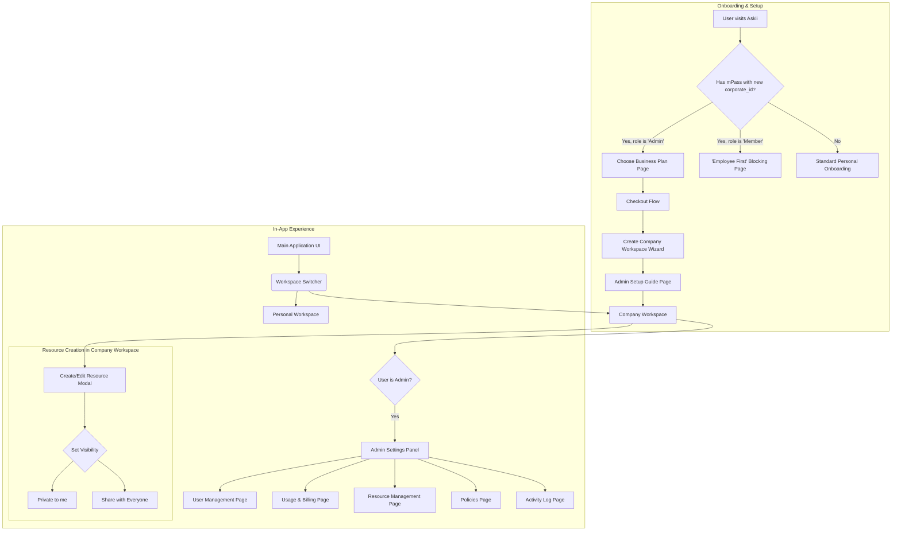
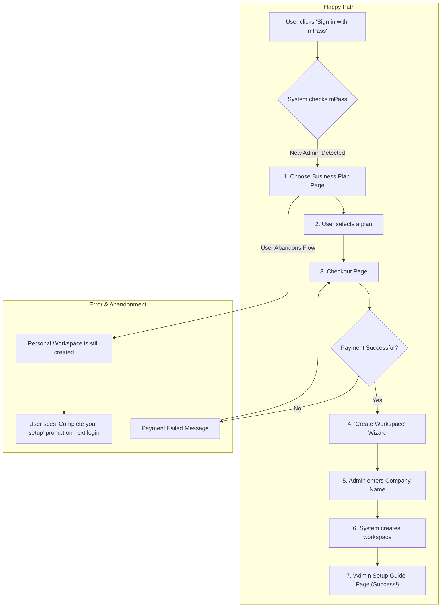
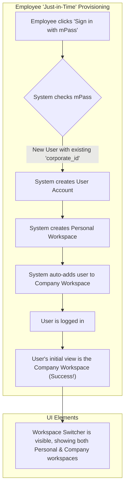
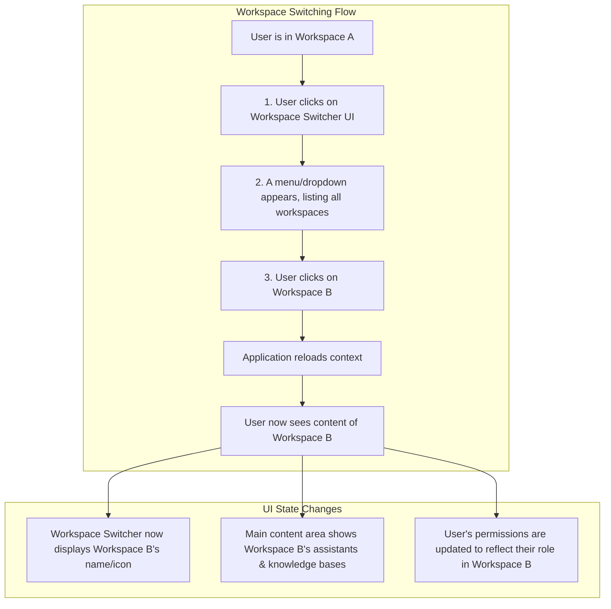
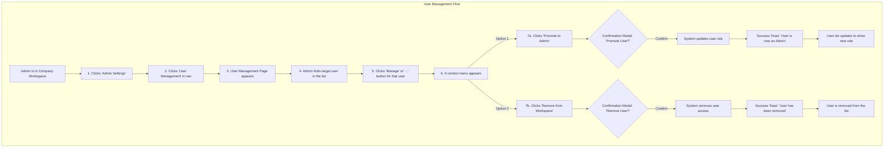
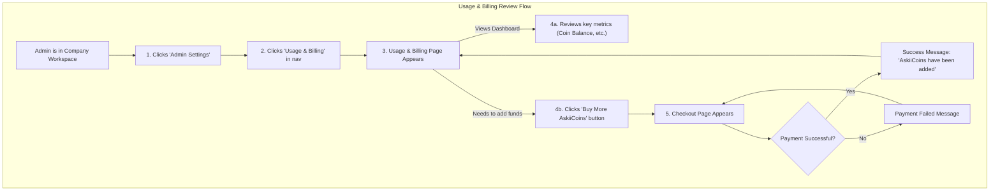
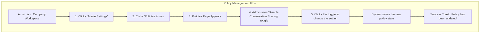
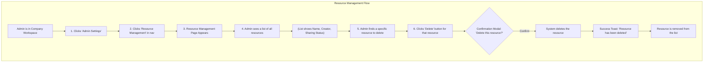

# Askii for SMBs MVP UI/UX Specification

## Introduction

This document defines the user experience goals, information architecture, user flows, and visual design specifications for the "Askii for SMBs" MVP's user interface. It serves as the foundation for visual design and frontend development, ensuring a cohesive and user-centered experience.

### Overall UX Goals & Principles

#### Target User Personas

For this MVP, we are designing for two primary personas:

*   **The Administrator:** This user is often a business owner, team lead, or IT manager. Their primary need is for **control, efficiency, and visibility**. They must be able to manage users, monitor costs, and set security policies with absolute confidence and minimal effort.
*   **The Team Member:** This user is an employee whose primary need is **productivity and seamless access to information**. Their experience should be as simple as the consumer product they are used to, with the added benefit of access to shared company knowledge.

#### Usability Goals

*   **Ease of Learning:** A new administrator should be able to create their workspace, invite users, and understand the billing dashboard within their first 10 minutes on the platform.
*   **Efficiency of Use:** An administrator should be able to perform common tasks (like removing a user or checking AskiiCoin balance) in three clicks or fewer from the main dashboard.
*   **Clarity & Confidence:** The UI must provide clear, unambiguous feedback for all administrative actions. The admin should never be in doubt about the effect of their actions.
*   **Seamless Context Switching:** A team member must be able to switch between their Personal and Company workspaces with a single click, with no confusion about which context they are in.

#### Design Principles

1.  **Clarity Above All:** Especially in the admin settings, the interface must be clear, predictable, and free of jargon. The cost of an admin making a mistake is high, so the design must prioritize clarity over aesthetic novelty.
2.  **Progressive Disclosure:** We will avoid overwhelming users with too many options. The interface will show only what is needed for the current task, with more advanced settings tucked away in clearly marked sections.
3.  **Consistency is Key:** The SMB experience must feel like a natural extension of the existing Askii platform. We will reuse existing design patterns, components, and styles wherever possible to ensure a consistent and familiar user experience.
4.  **Empowerment with Guardrails:** We will empower all users to create and share resources, but we will provide administrators with the "guardrails" (like oversight dashboards and security policies) they need to feel in control.

### Change Log

| Date       | Version | Description                   | Author |
| :--------- | :------ | :---------------------------- | :----- |
| 2025-11-03 | 1.0     | Initial draft of the FE Spec. | Sally  |

## Information Architecture (IA)

### Site Map / Screen Inventory

This diagram shows the high-level structure of the new screens and their relationship to the existing application.

### Navigation Structure

*   **Primary Navigation:** The existing primary navigation of the Askii app will remain largely unchanged. The only addition will be the new, persistent **Workspace Switcher** component, likely located in a prominent position such as the top-left corner or within the user's profile menu.

*   **Secondary Navigation (Admin Panel):** A new navigation area will be introduced for administrators. When an admin is inside a Company Workspace, a new "Admin Settings" or "Workspace Settings" link will appear. Clicking this will take them to the "Admin Settings" Panel, which will have its own secondary navigation to switch between the five admin pages.

## User Flows

### Flow 1: First-Time Admin Onboarding
*   **User Goal:** To sign up for Askii for the first time as a company administrator, subscribe to a business plan, and create a secure workspace for my team.
*   **Entry Points:** Clicking "Sign in with mPass" from the Askii homepage or a marketing page.
*   **Success Criteria:** The admin successfully creates a Company Workspace and lands on the "Setup Your Workspace" guide page.

#### Flow Diagram

### Flow 2: Seamless Employee Onboarding
*   **User Goal:** To sign up for Askii for the first time as a new employee and get instant access to my company's shared workspace.
*   **Entry Points:** Clicking "Sign in with mPass" from the Askii homepage.
*   **Success Criteria:** The employee is successfully logged in and their initial view is the Company Workspace.

#### Flow Diagram

### Flow 3: Switching Between Workspaces
*   **User Goal:** To easily and quickly switch between my Personal Workspace and my Company Workspace.
*   **Entry Points:** The user is logged in and viewing the main application UI.
*   **Success Criteria:** The user can switch to a different workspace in two clicks, and the application's context updates instantly and clearly.

#### Flow Diagram

### Flow 4: Admin Manages Workspace Users
*   **User Goal:** To find a specific user in my workspace and either change their role or remove their access.
*   **Entry Points:** The user is an admin inside the Company Workspace.
*   **Success Criteria:** The admin successfully modifies a user's role or removes them with clear feedback.

#### Flow Diagram

### Flow 5: Admin Reviews Usage & Billing
*   **User Goal:** To understand how my team is using Askii and how much it's costing.
*   **Entry Points:** The user is an admin inside the Company Workspace.
*   **Success Criteria:** The admin can find key cost and activity metrics and purchase more AskiiCoins.

#### Flow Diagram

### Flow 6: Admin Manages Security Policies
*   **User Goal:** To view and change the security settings for my workspace.
*   **Entry Points:** The user is an admin inside the Company Workspace.
*   **Success Criteria:** The admin can successfully change a policy, and the change is saved with clear feedback.

#### Flow Diagram

### Flow 7: Admin Manages Workspace Resources
*   **User Goal:** To have an overview of all resources created in my workspace and remove any that are no longer needed.
*   **Entry Points:** The user is an admin inside the Company Workspace.
*   **Success Criteria:** The admin can successfully find and delete a specific resource.

#### Flow Diagram

## Wireframes & Mockups

The primary design files and high-fidelity mockups for this project will be created in Figma.

**Primary Design Files:** `[Link to Figma Project - TBD]`

### Key Screen Layouts

#### Screen 1: "Choose Your Business Plan" Page
*   **Purpose:** To present the available "Askii for Business" subscription plans to a new administrator and guide them to the checkout process.
*   **Key Elements:** Headline, Plan Comparison Table (with plan name, price, AskiiCoins, key features), "Choose Plan" CTA button for each plan.

#### Screen 2: "Create Company Workspace" Wizard
*   **Purpose:** To allow a new administrator to officially name their company's workspace after subscribing.
*   **Key Elements:** Headline, a single "Company Name" input field, informational helper text, and a "Create Workspace" CTA button.

#### Screen 3: Admin "Setup Your Workspace" Guide
*   **Purpose:** To onboard the new administrator through a simple checklist of key "first actions."
*   **Key Elements:** Welcoming headline, an onboarding checklist (e.g., "Create Knowledge Base," "Create Assistant"), a progress indicator, and a "Skip for now" link.

#### Component 4: The Workspace Switcher
*   **Purpose:** A persistent UI component to show the current workspace and allow switching between all available workspaces.
*   **Key Elements:** A button/display showing the current workspace name, which opens a dropdown menu listing all other workspaces.

#### Screen 5: The Admin Settings Panel
*   **Purpose:** A central, secure hub for all administrative tasks, accessible only to admins.
*   **Key Elements:** A two-column layout with a dedicated secondary navigation on the left (for User Management, Billing, etc.) and a content area on the right. All destructive actions must have confirmation modals.

#### Component 6: Resource Creation/Sharing Controls (Updated Modals)
*   **Purpose:** An addition to the existing "Create Resource" modals to set visibility.
*   **Key Elements:** A mandatory set of radio buttons with two options: "Private to me" and "Share with Everyone in [Company Name] Workspace."

#### Screen 7: "Employee First" Blocking Page
*   **Purpose:** A simple, static page to inform an employee who signs up before their admin has created the workspace.
*   **Key Elements:** A clear headline ("Your Workspace Isn't Ready Yet") and simple, helpful body text instructing them to contact their admin.

## Component Library / Design System

**Design System Approach:** The project will adhere to and extend the existing Askii Design System to ensure a consistent user experience. New elements will be built as reusable components.

**Core New Components to be Added:**
1.  **Workspace Switcher:** The core UI control for switching between workspaces.
2.  **Admin Settings Layout:** A standard two-column layout for all admin pages.
3.  **Usage Dashboard Widget:** Reusable cards for displaying key metrics on the billing/usage page.

## Branding & Style Guide

All new UI must adhere strictly to the established Askii Brand Guidelines and consume all colors, typography, and styles from the existing design system.

## Accessibility Requirements

*   **Compliance Target:** All new components and screens must meet **WCAG 2.1 Level AA** standards.
*   **Key Requirements:** Full keyboard navigation, proper screen reader support, and sufficient color contrast are mandatory.

## Responsiveness Strategy

*   **Breakpoints:** All new screens will adhere to the existing breakpoints of the platform (Mobile, Tablet, Desktop).
*   **Adaptation Patterns:** Data-dense admin panels will reflow into single-column layouts on smaller screens.

## Animation & Micro-interactions

*   **Motion Principles:** Animation will be purposeful, used to provide feedback and guide attention, adhering to the existing motion design language.

## Performance Considerations

*   **Performance Goals:** Admin pages should load in under 3 seconds, and all UI interactions should provide feedback in under 100ms.
*   **Design Strategies:** We will use code splitting for the admin panel and employ skeleton loaders to improve perceived performance.
