# Moneta for Enterprise (Corporate mPass) UI/UX Specification

## Introduction

This document defines the user experience goals, information architecture, user flows, and visual design specifications for the Moneta for Enterprise (Corporate mPass)'s user interface. It serves as the foundation for visual design and frontend development, ensuring a cohesive and user-centered experience.

### Overall UX Goals & Principles
#### Target User Personas
*   **Corporate Administrator (Admin):** An IT, Finance, or Operations Manager who needs to control costs, manage access, and simplify billing for all digital services their employees use.
*   **Corporate Employee (mPass User):** Any employee who needs seamless, on-demand access to premium digital tools for their job without using personal payment methods or filing expense reports.
*   **MO Admin:** An enterprise account manager at an MO who needs a system to onboard, manage risk for, and support their corporate clients.

#### Usability Goals
*   **Ease of Learning:** A new administrator should be able to successfully onboard their first employee and set a company-wide policy within 10 minutes of their first login, without needing a tutorial.
*   **Efficiency of Use:** An experienced admin should be able to perform common, frequent tasks (e.g., invite a user, suspend a user, find a transaction) in three clicks or less from the main dashboard.
*   **Error Prevention:** The interface must prevent users from making critical financial or security errors. All destructive actions (deleting a group, removing a user) must have a clear confirmation step. Policy controls must provide clear feedback about their impact.
*   **Clarity & Confidence:** The admin should always feel confident about the state of the system, particularly regarding spending, credit limits, and who has access to what. The UI must present this information clearly and unambiguously.

#### Design Principles
1.  **Effortless Control:** The UI should empower admins with powerful controls that feel simple and intuitive. Complexity should be hidden until needed (Progressive Disclosure).
2.  **Clarity Above All:** Financial and access-control data must be presented with absolute clarity. Avoid ambiguity in labels, data visualizations, and status indicators.
3.  **Trustworthy & Professional:** The visual design must be clean, professional, and secure. As a platform managing company finances, it must inspire confidence at every step.
4.  **Provide Immediate Feedback:** Every user action must result in a clear, immediate, and visible system response (e.g., a success toast, a status update in a table).

### Change Log

| Date         | Version | Description                           | Author     |
| :----------- | :------ | :------------------------------------ | :--------- |
| Oct 20, 2025 | 1.0     | Initial draft based on the PRD v1.3.0 | Sally (UX) |

## 2. Information Architecture (IA)

### Site Map / Screen Inventory

This diagram provides a comprehensive, hierarchical view of the entire Corporate mPass Platform, breaking down the distinct portals for Corporate Administrators, MO Administrators, and Corporate Employees.


```mermaid
graph TD
    Root[Corporate mPass Platform]
    
    Root --> CorpAdmin[Corporate Administrator Portal]
    Root --> mPassApp[mPass App - Corporate Employee]
    Root --> MOAdmin[MO Admin Portal]
    
    %% Corporate Administrator Portal
    CorpAdmin --> AdminDash[Dashboard]
    CorpAdmin --> UserMgmt[User Management]
    CorpAdmin --> PolicyMgmt[Policy Management]
    CorpAdmin --> Billing[Billing & Reporting]
    CorpAdmin --> Disputes[Dispute Management]
    CorpAdmin --> AdminSettings[Account Settings]
    
    %% User Management Section
    UserMgmt --> EmpList[Employee List]
    UserMgmt --> InviteUser[Invite Users]
    UserMgmt --> UserGroups[User Groups]
    
    EmpList --> EmpDetails[Employee Details]
    EmpDetails --> SuspendEmp[Suspend/De-provision]
    
    InviteUser --> SingleInvite[Single Email Invite]
    InviteUser --> BulkUpload[Bulk Upload via CSV]
    
    UserGroups --> CreateGroup[Create Group]
    UserGroups --> GroupList[View Groups]
    GroupList --> GroupDetails[Group Details]
    GroupDetails --> AssignUsers[Assign Users]
    GroupDetails --> RemoveUsers[Remove Users]
    GroupDetails --> DeleteGroup[Delete Group]
    
    %% Policy Management Section
    PolicyMgmt --> CompanyPolicy[Company-Wide Policies]
    PolicyMgmt --> GroupPolicy[Group Policies]
    PolicyMgmt --> IndividualPolicy[Individual Policies]
    
    CompanyPolicy --> CompanySpending[Spending Limits]
    CompanyPolicy --> CompanyAccess[Service Access Control]
    
    GroupPolicy --> GroupSpending[Group Spending Limits]
    GroupPolicy --> GroupAccess[Group Service Access]
    
    IndividualPolicy --> IndSpending[Individual Spending Limits]
    IndividualPolicy --> IndAccess[Individual Service Access]
    
    CompanyAccess --> Whitelist[Whitelist Publishers/Categories]
    CompanyAccess --> Blacklist[Blacklist Publishers/Categories]
    
    %% Billing & Reporting Section
    Billing --> TransLog[Transaction Log]
    Billing --> Statements[Monthly Statements]
    Billing --> Reports[Reports & Analytics]
    Billing --> Payment[Make Payment]
    
    TransLog --> FilterTrans[Filter & Sort Transactions]
    TransLog --> DisputeTrans[Dispute Transaction]
    
    Reports --> GroupReport[By User Group]
    Reports --> EmployeeReport[By Employee]
    Reports --> ExportReport[Export Data]
    
    %% Dispute Management Section
    Disputes --> DisputeLog[Dispute Log]
    Disputes --> ViewCredits[View Compensations]
    
    %% mPass App - Corporate Employee Experience
    mPassApp --> Guide[mPass Guide - Filtered]
    mPassApp --> History[Transaction History]
    mPassApp --> Profile[Profile]
    
    Guide --> BrowseServices[Browse Services - Policy-Based]
    BrowseServices --> SelectService[Select Service]
    SelectService --> Authorize[Authorization Request]
    Authorize --> PolicyCheck[Policy & Budget Check]
    
    History --> ViewTrans[View Transactions]
    ViewTrans --> DisputeAction[Dispute Transaction]
    
    Profile --> EmpSettings[Settings]
    Profile --> Notifications[Notifications]
    Notifications --> PolicyDenial[Policy Denial Alerts]
    
    %% MO Admin Portal
    MOAdmin --> MODash[Dashboard]
    MOAdmin --> AppQueue[Application Queue]
    MOAdmin --> CorpAccounts[Corporate Accounts]
    MOAdmin --> EnterpriseBilling[Enterprise Billing & Transactions]
    MOAdmin --> MOReports[Reports & Analytics]
    MOAdmin --> RiskMgmt[Risk Management]
    
    %% Application Queue
    AppQueue --> PendingApps[Pending Applications]
    AppQueue --> ReviewedApps[Reviewed Applications]
    
    PendingApps --> ReviewApp[Review Application]
    ReviewApp --> ApproveApp[Approve]
    ReviewApp --> DenyApp[Deny]
    ApproveApp --> SetLimit[Set Credit Limit]
    
    %% Corporate Accounts Management
    CorpAccounts --> ActiveAccounts[Active Accounts]
    CorpAccounts --> SuspendedAccounts[Suspended Accounts]
    
    ActiveAccounts --> CorpDetails[Account Details]
    CorpDetails --> SuspendCorp[Suspend Account]
    CorpDetails --> ResumeCorp[Resume Account]
    CorpDetails --> ViewActivity[View Activity]
    CorpDetails --> AdjustLimit[Adjust Credit Limit]
    
    %% Enterprise Billing & Transactions
    EnterpriseBilling --> AllCorpTransactions[All Corporate Transactions]
    EnterpriseBilling --> CorpStatements[Corporate Statements]
    EnterpriseBilling --> PaymentTracking[Payment Tracking]
    EnterpriseBilling --> DisputeMonitoring[Dispute Monitoring]
    
    AllCorpTransactions --> FilterByCompany[Filter by Company]
    AllCorpTransactions --> FilterByDate[Filter by Date]
    AllCorpTransactions --> TransactionDetails[Transaction Details]
    
    CorpStatements --> PendingStatements[Pending Statements]
    CorpStatements --> PaidStatements[Paid Statements]
    CorpStatements --> OverdueStatements[Overdue Statements]
    
    PendingStatements --> StatementDetails[Statement Details]
    StatementDetails --> ViewLineItems[View Line Items]
    StatementDetails --> ViewDisputes[View Statement Disputes]
    
    PaymentTracking --> ReceivedPayments[Received Payments]
    PaymentTracking --> PendingPayments[Pending Payments]
    PaymentTracking --> FailedPayments[Failed Payments]
    
    DisputeMonitoring --> AllDisputes[All Corporate Disputes]
    DisputeMonitoring --> DisputeTrends[Dispute Trends]
    AllDisputes --> DisputeByCompany[By Company]
    AllDisputes --> DisputeByStatus[By Status]
    
    %% Risk Management
    RiskMgmt --> CTSScores[Corporate Trust Scores]
    RiskMgmt --> RiskAlerts[Risk Alerts]
    RiskMgmt --> CreditUtilization[Credit Utilization]
    
    CTSScores --> LowScoreAccounts[Low Score Accounts]
    CTSScores --> ScoreHistory[Score History]
    
    RiskAlerts --> HighDisputeRate[High Dispute Rate]
    RiskAlerts --> CreditLimitAlerts[Credit Limit Alerts]
    RiskAlerts --> SuspiciousActivity[Suspicious Activity]
    
    %% Styling
    classDef adminClass fill:#e1f5ff,stroke:#0288d1,stroke-width:2px
    classDef mpassClass fill:#f3e5f5,stroke:#7b1fa2,stroke-width:2px
    classDef moClass fill:#fff3e0,stroke:#f57c00,stroke-width:2px
    classDef rootClass fill:#e8f5e9,stroke:#388e3c,stroke-width:3px
    
    class CorpAdmin,AdminDash,UserMgmt,PolicyMgmt,Billing,Disputes,AdminSettings,EmpList,InviteUser,UserGroups,EmpDetails,SuspendEmp,SingleInvite,BulkUpload,CreateGroup,GroupList,GroupDetails,AssignUsers,RemoveUsers,DeleteGroup,CompanyPolicy,GroupPolicy,IndividualPolicy,CompanySpending,CompanyAccess,GroupSpending,GroupAccess,IndSpending,IndAccess,Whitelist,Blacklist,TransLog,Statements,Reports,Payment,FilterTrans,DisputeTrans,GroupReport,EmployeeReport,ExportReport,DisputeLog,ViewCredits adminClass
    
    class mPassApp,Guide,History,Profile,BrowseServices,SelectService,Authorize,PolicyCheck,ViewTrans,DisputeAction,EmpSettings,Notifications,PolicyDenial mpassClass
    
    class MOAdmin,MODash,AppQueue,CorpAccounts,EnterpriseBilling,MOReports,RiskMgmt,PendingApps,ReviewedApps,ReviewApp,ApproveApp,DenyApp,SetLimit,ActiveAccounts,SuspendedAccounts,CorpDetails,SuspendCorp,ResumeCorp,ViewActivity,AdjustLimit,AllCorpTransactions,CorpStatements,PaymentTracking,DisputeMonitoring,FilterByCompany,FilterByDate,TransactionDetails,PendingStatements,PaidStatements,OverdueStatements,StatementDetails,ViewLineItems,ViewDisputes,ReceivedPayments,PendingPayments,FailedPayments,AllDisputes,DisputeTrends,DisputeByCompany,DisputeByStatus,CTSScores,RiskAlerts,CreditUtilization,LowScoreAccounts,ScoreHistory,HighDisputeRate,CreditLimitAlerts,SuspiciousActivity moClass
    
    class Root rootClass
```

### Navigation Structure

*   **Primary Navigation (Admin Portals):** After login, a persistent vertical sidebar will provide access to the main sections of either the MO or Enterprise Admin portal. This ensures that core features are always just one click away.
*   **Secondary Navigation:** Not required for the MVP, as the application structure is relatively flat within each primary section.
*   **Breadcrumb Strategy:** Breadcrumbs will be used to show the user's current location when they navigate into nested views. For example: `User Management > User Groups > Marketing Team`.

## 3. User Flows

This section provides detailed, step-by-step diagrams for key user workflows within the platform.

### 4.1. Flow 1: New Enterprise Onboarding

This flow describes how a new enterprise registers for the Corporate mPass service and gets approved by the Membership Organization (MO).

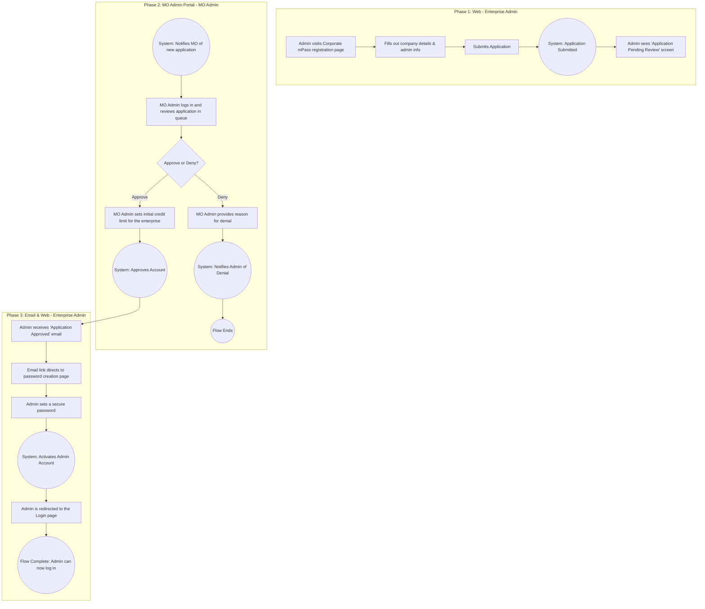
```mermaid
graph TD
    subgraph "Phase 1: Web - Enterprise Admin"
        A[Admin visits Corporate mPass registration page] --> B[Fills out company details & admin info]
        B --> C[Submits Application]
        C --> D((System: Application Submitted))
        D --> E[Admin sees 'Application Pending Review' screen]
    end

    subgraph "Phase 2: MO Admin Portal - MO Admin"
        F((System: Notifies MO of new application)) --> G[MO Admin logs in and reviews application in queue]
        G --> H{Approve or Deny?}
        H -- Deny --> I[MO Admin provides reason for denial]
        I --> J((System: Notifies Admin of Denial))
        J --> EndDeny((Flow Ends))
        H -- Approve --> K[MO Admin sets initial credit limit for the enterprise]
        K --> L((System: Approves Account))
    end

    subgraph "Phase 3: Email & Web - Enterprise Admin"
        L --> M[Admin receives 'Application Approved' email]
        M --> N[Email link directs to password creation page]
        N --> O[Admin sets a secure password]
        O --> P((System: Activates Admin Account))
        P --> Q[Admin is redirected to the Login page]
        Q --> Success((Flow Complete: Admin can now log in))
    end
```

### 4.2. Flow 2: Inviting a New Employees

This flow covers the process for an admin inviting a single employee to the corporate mPass program.

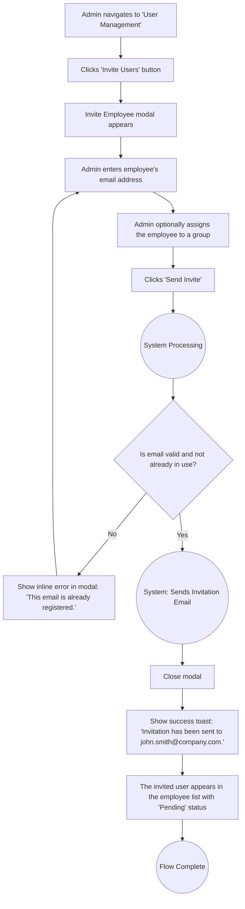
```mermaid
graph TD
    A[Admin navigates to 'User Management'] --> B[Clicks 'Invite Users' button]
    B --> C[Invite Employee modal appears]
    C --> D[Admin enters employee's email address]
    D --> E[Admin optionally assigns the employee to a group]
    E --> F[Clicks 'Send Invite']
    F --> G((System Processing))
    G --> H{Is email valid and not already in use?}
    H -- No --> I[Show inline error in modal: 'This email is already registered.']
    I --> D
    H -- Yes --> J((System: Sends Invitation Email))
    J --> K[Close modal]
    K --> L[Show success toast: 'Invitation has been sent to john.smith@company.com.']
    L --> M[The invited user appears in the employee list with 'Pending' status]
    M --> Success((Flow Complete))
```

### 4.3. Flow 3: Bulk Inviting New Employees

This flow allows admins to invite multiple employees at once by uploading a CSV file.

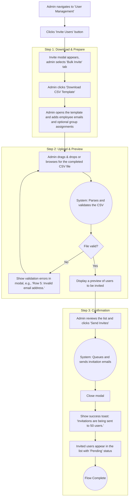
```mermaid
graph TD
    A[Admin navigates to 'User Management'] --> B[Clicks 'Invite Users' button]
    B --> C[Invite modal appears, admin selects 'Bulk Invite' tab]

    subgraph "Step 1: Download & Prepare"
        C --> D[Admin clicks 'Download CSV Template']
        D --> E[Admin opens the template and adds employee emails and optional group assignments]
    end

    subgraph "Step 2: Upload & Preview"
        E --> F[Admin drags & drops or browses for the completed CSV file]
        F --> G((System: Parses and validates the CSV))
        G --> H{File valid?}
        H -- No --> I[Show validation errors in modal, e.g., 'Row 5: Invalid email address.']
        I --> F
        H -- Yes --> J[Display a preview of users to be invited]
    end

    subgraph "Step 3: Confirmation"
        J --> K[Admin reviews the list and clicks 'Send Invites']
        K --> L((System: Queues and sends invitation emails))
        L --> M[Close modal]
        M --> N[Show success toast: 'Invitations are being sent to 50 users.']
        N --> O[Invited users appear in the list with 'Pending' status]
        O --> Success((Flow Complete))
    end
```

### 4.4. Flow 4: Employee Invitation Acceptance & Activation

This flow details how an invited employee activates their corporate mPass using the mobile app.

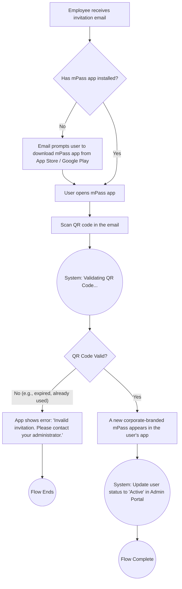
```mermaid
graph TD
    A[Employee receives invitation email] --> B{Has mPass app installed?};
    B -- No --> C[Email prompts user to download mPass app from App Store / Google Play];
    C --> D[User opens mPass app];
    B -- Yes --> D;

    D --> F[Scan QR code in the email];
    
    F --> H((System: Validating QR Code...));
    H --> I{QR Code Valid?};
    I -- "No (e.g., expired, already used)" --> J[App shows error: 'Invalid invitation. Please contact your administrator.'];
    J --> End((Flow Ends));
    I -- Yes --> M[A new corporate-branded mPass appears in the user's app];
    M --> O((System: Update user status to 'Active' in Admin Portal));
    O --> Success((Flow Complete)); 
```

### 4.5. Flow 5: Employee Lifecycle Management

This flow shows how an admin can suspend, reactivate, or permanently remove an employee account.

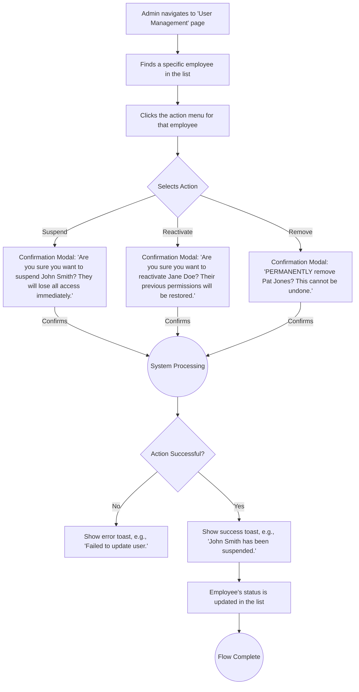
```mermaid
graph TD
    A[Admin navigates to 'User Management' page] --> B[Finds a specific employee in the list]
    B --> C[Clicks the action menu for that employee]
    C --> D{Selects Action}
    D -- Suspend --> E1[Confirmation Modal: 'Are you sure you want to suspend John Smith? They will lose all access immediately.']
    D -- Reactivate --> E2[Confirmation Modal: 'Are you sure you want to reactivate Jane Doe? Their previous permissions will be restored.']
    D -- Remove --> E3[Confirmation Modal: 'PERMANENTLY remove Pat Jones? This cannot be undone.']

    E1 -- Confirms --> F((System Processing))
    E2 -- Confirms --> F
    E3 -- Confirms --> F

    F --> G{Action Successful?}
    G -- No --> H[Show error toast, e.g., 'Failed to update user.']
    G -- Yes --> I[Show success toast, e.g., 'John Smith has been suspended.']
    I --> J[Employee's status is updated in the list]
    J --> Success((Flow Complete))
```

### 4.6. Flow 6: User Group Creation

This flow outlines the simple process of creating a new user group.

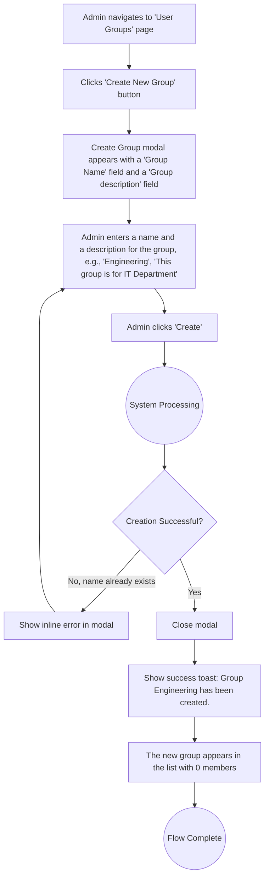
```mermaid
graph TD
    A[Admin navigates to 'User Groups' page] --> B[Clicks 'Create New Group' button]
    B --> C[Create Group modal appears with a 'Group Name' field and a 'Group description' field]
    C --> D[Admin enters a name and a description for the group, e.g., 'Engineering', 'This group is for IT Department']
    D --> E[Admin clicks 'Create']
    E --> F((System Processing))
    F --> G{Creation Successful?}
    G -- "No, name already exists" --> H[Show inline error in modal]
    H --> D
    G -- "Yes" --> I[Close modal]
    I --> J[Show success toast: Group Engineering has been created.]
    J --> K[The new group appears in the list with 0 members]
    K --> Success((Flow Complete))
```

### 4.7. Flow 7: Managing Group Membership

This flow details how an admin assigns and removes employees from a specific group.

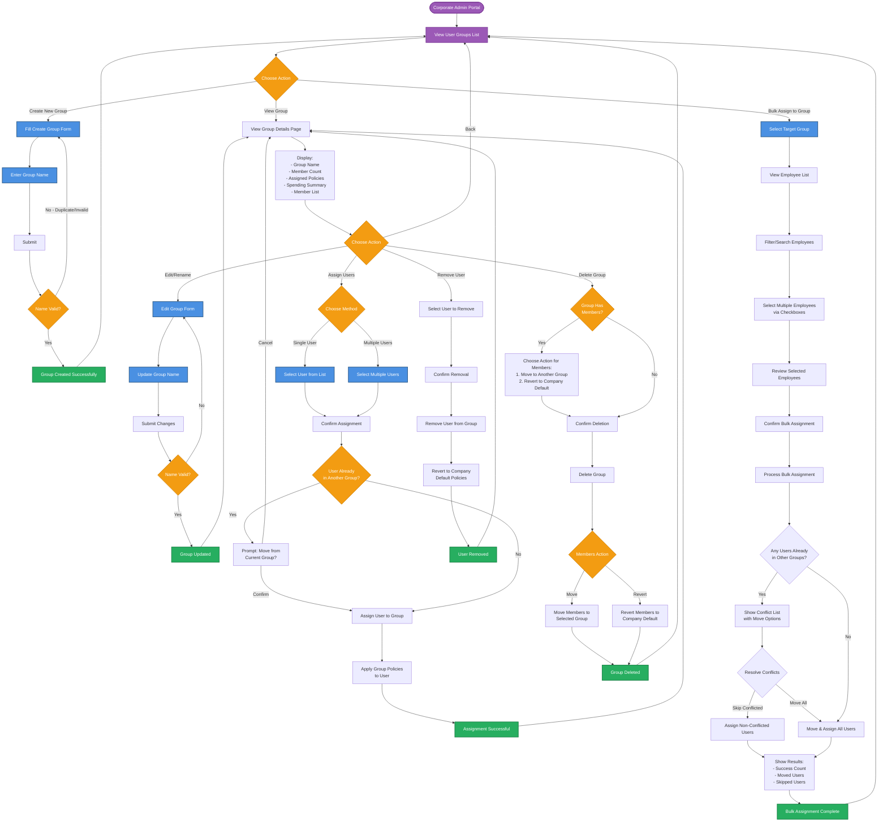
```mermaid
flowchart TD
    Start([Corporate Admin Portal]) --> GroupDashboard[View User Groups List]

    GroupDashboard --> Action{Choose Action}

    %% Create Group Flow
    Action -->|Create New Group| CreateForm[Fill Create Group Form]
    CreateForm --> EnterName[Enter Group Name]
    EnterName --> SubmitCreate[Submit]
    SubmitCreate --> ValidateName{Name Valid?}
    ValidateName -->|No - Duplicate/Invalid| CreateForm
    ValidateName -->|Yes| GroupCreated[Group Created Successfully]
    GroupCreated --> GroupDashboard

    %% View Group Details
    Action -->|View Group| GroupDetails[View Group Details Page]
    GroupDetails --> ShowDetails[Display:<br/>- Group Name<br/>- Member Count<br/>- Assigned Policies<br/>- Spending Summary<br/>- Member List]
    ShowDetails --> GroupAction{Choose Action}

    %% Edit Group
    GroupAction -->|Edit/Rename| EditForm[Edit Group Form]
    EditForm --> UpdateName[Update Group Name]
    UpdateName --> SubmitEdit[Submit Changes]
    SubmitEdit --> ValidateEdit{Name Valid?}
    ValidateEdit -->|No| EditForm
    ValidateEdit -->|Yes| GroupUpdated[Group Updated]
    GroupUpdated --> GroupDetails

    %% Assign Users
    GroupAction -->|Assign Users| AssignMethod{Choose Method}
    AssignMethod -->|Single User| SelectUser[Select User from List]
    AssignMethod -->|Multiple Users| SelectMultiple[Select Multiple Users]
    SelectUser --> ConfirmAssign[Confirm Assignment]
    SelectMultiple --> ConfirmAssign
    ConfirmAssign --> CheckConflict{User Already<br/>in Another Group?}
    CheckConflict -->|Yes| MovePrompt[Prompt: Move from<br/>Current Group?]
    MovePrompt -->|Cancel| GroupDetails
    MovePrompt -->|Confirm| AssignUser[Assign User to Group]
    CheckConflict -->|No| AssignUser
    AssignUser --> UpdatePolicies[Apply Group Policies<br/>to User]
    UpdatePolicies --> AssignSuccess[Assignment Successful]
    AssignSuccess --> GroupDetails

    %% Remove Users
    GroupAction -->|Remove User| SelectRemove[Select User to Remove]
    SelectRemove --> ConfirmRemove[Confirm Removal]
    ConfirmRemove --> RemoveUser[Remove User from Group]
    RemoveUser --> RevertPolicy[Revert to Company<br/>Default Policies]
    RevertPolicy --> RemoveSuccess[User Removed]
    RemoveSuccess --> GroupDetails

    %% Delete Group
    GroupAction -->|Delete Group| CheckMembers{Group Has<br/>Members?}
    CheckMembers -->|Yes| DeleteOptions[Choose Action for Members:<br/>1. Move to Another Group<br/>2. Revert to Company Default]
    DeleteOptions --> ConfirmDelete[Confirm Deletion]
    CheckMembers -->|No| ConfirmDelete
    ConfirmDelete --> ProcessDelete[Delete Group]
    ProcessDelete --> HandleMembers{Members Action}
    HandleMembers -->|Move| MoveToGroup[Move Members to<br/>Selected Group]
    HandleMembers -->|Revert| RevertMembers[Revert Members to<br/>Company Default]
    MoveToGroup --> DeleteSuccess[Group Deleted]
    RevertMembers --> DeleteSuccess
    DeleteSuccess --> GroupDashboard

    %% Bulk Assign Flow
    Action -->|Bulk Assign to Group| SelectGroup[Select Target Group]
    SelectGroup --> ViewEmployeeList[View Employee List]
    ViewEmployeeList --> FilterSearch[Filter/Search Employees]
    FilterSearch --> SelectMultipleEmp[Select Multiple Employees<br/>via Checkboxes]
    SelectMultipleEmp --> ReviewSelection[Review Selected Employees]
    ReviewSelection --> ConfirmBulkAssign[Confirm Bulk Assignment]
    ConfirmBulkAssign --> ProcessBulk[Process Bulk Assignment]
    ProcessBulk --> CheckBulkConflicts{Any Users Already<br/>in Other Groups?}
    CheckBulkConflicts -->|Yes| ShowConflictList[Show Conflict List<br/>with Move Options]
    ShowConflictList --> ResolveBulk{Resolve Conflicts}
    ResolveBulk -->|Skip Conflicted| AssignNonConflicted[Assign Non-Conflicted Users]
    ResolveBulk -->|Move All| AssignAll[Move & Assign All Users]
    CheckBulkConflicts -->|No| AssignAll
    AssignNonConflicted --> ShowResults
    AssignAll --> ShowResults
    ShowResults[Show Results:<br/>- Success Count<br/>- Moved Users<br/>- Skipped Users]
    ShowResults --> BulkComplete[Bulk Assignment Complete]
    BulkComplete --> GroupDashboard

    %% Return to Dashboard
    GroupAction -->|Back| GroupDashboard

    %% Styling
    classDef processStyle fill:#4A90E2,stroke:#2E5C8A,stroke-width:2px,color:#fff
    classDef decisionStyle fill:#F39C12,stroke:#D68910,stroke-width:2px,color:#fff
    classDef successStyle fill:#27AE60,stroke:#1E8449,stroke-width:2px,color:#fff
    classDef errorStyle fill:#E74C3C,stroke:#C0392B,stroke-width:2px,color:#fff
    classDef startStyle fill:#9B59B6,stroke:#7D3C98,stroke-width:2px,color:#fff

    class Start,GroupDashboard startStyle
    class CreateForm,EditForm,EnterName,UpdateName,SelectUser,SelectMultiple,SelectGroup processStyle
    class Action,GroupAction,ValidateName,ValidateEdit,CheckConflict,CheckMembers,HandleMembers,AssignMethod decisionStyle
    class GroupCreated,GroupUpdated,AssignSuccess,RemoveSuccess,DeleteSuccess,BulkComplete successStyle
    class ShowErrors errorStyle
 
```

### 4.8. Flow 8: Centralized Policy Management

This flow describes the high-level process of an admin managing policies from the central Policy Management page.


```mermaid
flowchart TD
    Start([Corporate Admin Portal]) --> PolicyDashboard[Policy Management Dashboard]
    
    PolicyDashboard --> ShowHierarchy[Display Policy Hierarchy:<br/>Company → Groups → Individuals]
    ShowHierarchy --> SelectLevel{Select Policy Level}
    
    %% Company-Wide Policy Flow
    SelectLevel -->|Company Policy| CompanyPolicy[Company-Wide Policy Page]
    CompanyPolicy --> CompanyView[View Current Policy:<br/>- Monthly Spending Limit<br/>- Service Access Rules]
    CompanyView --> CompanyAction{Choose Action}
    
    CompanyAction -->|Edit Spending Limit| CompanySpendForm[Edit Spending Limit Form]
    CompanySpendForm --> EnterCompanyLimit[Enter Monthly Limit Amount]
    EnterCompanyLimit --> ValidateCompanyLimit{Valid Amount?}
    ValidateCompanyLimit -->|No| CompanySpendForm
    ValidateCompanyLimit -->|Yes| SaveCompanyLimit[Save Company Limit]
    SaveCompanyLimit --> CompanySuccess[Company Limit Updated]
    CompanySuccess --> CompanyPolicy
    
    CompanyAction -->|Edit Service Access| CompanyServiceForm[Service Access Control]
    CompanyServiceForm --> SelectAccessType{Access Control Type}
    SelectAccessType -->|Whitelist| WhitelistCompany[Select Publishers/Categories<br/>to Allow]
    SelectAccessType -->|Blacklist| BlacklistCompany[Select Publishers/Categories<br/>to Block]
    WhitelistCompany --> SaveCompanyAccess[Save Company Access Rules]
    BlacklistCompany --> SaveCompanyAccess
    SaveCompanyAccess --> CompanyAccessSuccess[Service Access Updated]
    CompanyAccessSuccess --> CompanyPolicy
    
    %% Group Policy Flow
    SelectLevel -->|Group Policy| SelectGroup[Select User Group]
    SelectGroup --> GroupPolicy[Group Policy Page]
    GroupPolicy --> GroupView[View Current Policy:<br/>- Inherited from Company<br/>- Group Overrides]
    GroupView --> GroupAction{Choose Action}
    
    GroupAction -->|Set Group Spending Limit| GroupSpendForm[Edit Group Spending Limit]
    GroupSpendForm --> GroupLimitChoice{Set Limit Type}
    GroupLimitChoice -->|Override Company| EnterGroupLimit[Enter Group Monthly Limit]
    GroupLimitChoice -->|Inherit Company| InheritCompanyLimit[Use Company Limit]
    EnterGroupLimit --> ValidateGroupLimit{Valid & Within<br/>Company Limit?}
    ValidateGroupLimit -->|No| GroupSpendForm
    ValidateGroupLimit -->|Yes| SaveGroupLimit[Save Group Limit]
    InheritCompanyLimit --> SaveGroupLimit
    SaveGroupLimit --> GroupLimitSuccess[Group Limit Updated]
    GroupLimitSuccess --> GroupPolicy
    
    GroupAction -->|Set Group Service Access| GroupServiceForm[Group Service Access Control]
    GroupServiceForm --> GroupAccessChoice{Access Rule Type}
    GroupAccessChoice -->|Additional Restrictions| AddGroupRestrictions[Add More Restrictions<br/>Beyond Company Policy]
    GroupAccessChoice -->|Inherit Company| InheritCompanyAccess[Use Company Access Rules]
    AddGroupRestrictions --> ValidateGroupAccess{Rules Compatible<br/>with Company Policy?}
    ValidateGroupAccess -->|No - Conflict| GroupServiceForm
    ValidateGroupAccess -->|Yes| SaveGroupAccess[Save Group Access Rules]
    InheritCompanyAccess --> SaveGroupAccess
    SaveGroupAccess --> GroupAccessSuccess[Group Access Updated]
    GroupAccessSuccess --> GroupPolicy
    
    %% Individual Policy Flow
    SelectLevel -->|Individual Policy| SelectEmployee[Select Employee]
    SelectEmployee --> IndividualPolicy[Individual Employee Policy Page]
    IndividualPolicy --> IndividualView[View Effective Policy:<br/>- Inherited from Company<br/>- Inherited from Group<br/>- Individual Overrides]
    IndividualView --> IndividualAction{Choose Action}
    
    IndividualAction -->|Set Individual Spending Limit| IndividualSpendForm[Edit Individual Spending Limit]
    IndividualSpendForm --> IndividualLimitChoice{Set Limit Type}
    IndividualLimitChoice -->|Override| EnterIndividualLimit[Enter Individual Monthly Limit]
    IndividualLimitChoice -->|Inherit| InheritParentLimit[Use Group/Company Limit]
    EnterIndividualLimit --> ValidateIndividualLimit{Valid & Within<br/>Parent Limits?}
    ValidateIndividualLimit -->|No| IndividualSpendForm
    ValidateIndividualLimit -->|Yes| SaveIndividualLimit[Save Individual Limit]
    InheritParentLimit --> SaveIndividualLimit
    SaveIndividualLimit --> IndividualLimitSuccess[Individual Limit Updated]
    IndividualLimitSuccess --> IndividualPolicy
    
    IndividualAction -->|Set Individual Service Access| IndividualServiceForm[Individual Service Access Control]
    IndividualServiceForm --> IndividualAccessChoice{Access Rule Type}
    IndividualAccessChoice -->|Grant Exception| GrantAccess[Grant Access to<br/>Additional Services]
    IndividualAccessChoice -->|Add Restrictions| RestrictAccess[Restrict Specific Services]
    IndividualAccessChoice -->|Inherit| InheritParentAccess[Use Group/Company Rules]
    GrantAccess --> ValidateIndividualAccess{Rules Compatible<br/>with Parent Policies?}
    RestrictAccess --> ValidateIndividualAccess
    ValidateIndividualAccess -->|No - Conflict| IndividualServiceForm
    ValidateIndividualAccess -->|Yes| SaveIndividualAccess[Save Individual Access Rules]
    InheritParentAccess --> SaveIndividualAccess
    SaveIndividualAccess --> IndividualAccessSuccess[Individual Access Updated]
    IndividualAccessSuccess --> IndividualPolicy
    
    %% Policy Validation Note
    IndividualPolicy --> PolicyNote[Note: During Transaction Authorization<br/>MO validates against effective policy<br/>resolved from hierarchy]
    
    %% Back to Dashboard
    CompanyAction -->|Back| PolicyDashboard
    GroupAction -->|Back| PolicyDashboard
    IndividualAction -->|Back| PolicyDashboard
    
    %% Styling
    classDef processStyle fill:#4A90E2,stroke:#2E5C8A,stroke-width:2px,color:#fff
    classDef decisionStyle fill:#F39C12,stroke:#D68910,stroke-width:2px,color:#fff
    classDef successStyle fill:#27AE60,stroke:#1E8449,stroke-width:2px,color:#fff
    classDef viewStyle fill:#3498DB,stroke:#2874A6,stroke-width:2px,color:#fff
    classDef startStyle fill:#9B59B6,stroke:#7D3C98,stroke-width:2px,color:#fff
    classDef noteStyle fill:#E67E22,stroke:#CA6F1E,stroke-width:2px,color:#fff
    
    class Start,PolicyDashboard startStyle
    class CompanyPolicy,GroupPolicy,IndividualPolicy,ShowHierarchy,CompanyView,GroupView,IndividualView,DisplayEffective viewStyle
    class CompanySpendForm,CompanyServiceForm,GroupSpendForm,GroupServiceForm,IndividualSpendForm,IndividualServiceForm,EnterCompanyLimit,EnterGroupLimit,EnterIndividualLimit,WhitelistCompany,BlacklistCompany,AddGroupRestrictions,GrantAccess,RestrictAccess,SelectGroup,SelectEmployee,SelectPolicyView processStyle
    class SelectLevel,CompanyAction,GroupAction,IndividualAction,SelectAccessType,GroupLimitChoice,GroupAccessChoice,IndividualLimitChoice,IndividualAccessChoice,ValidateCompanyLimit,ValidateGroupLimit,ValidateGroupAccess,ValidateIndividualLimit,ValidateIndividualAccess,EffectiveAction decisionStyle
    class CompanySuccess,CompanyAccessSuccess,GroupLimitSuccess,GroupAccessSuccess,IndividualLimitSuccess,IndividualAccessSuccess successStyle
    class PolicyNote noteStyle
```

### 4.9. Flow 9: Transaction Monitoring

This flow shows how an admin monitors company transactions.

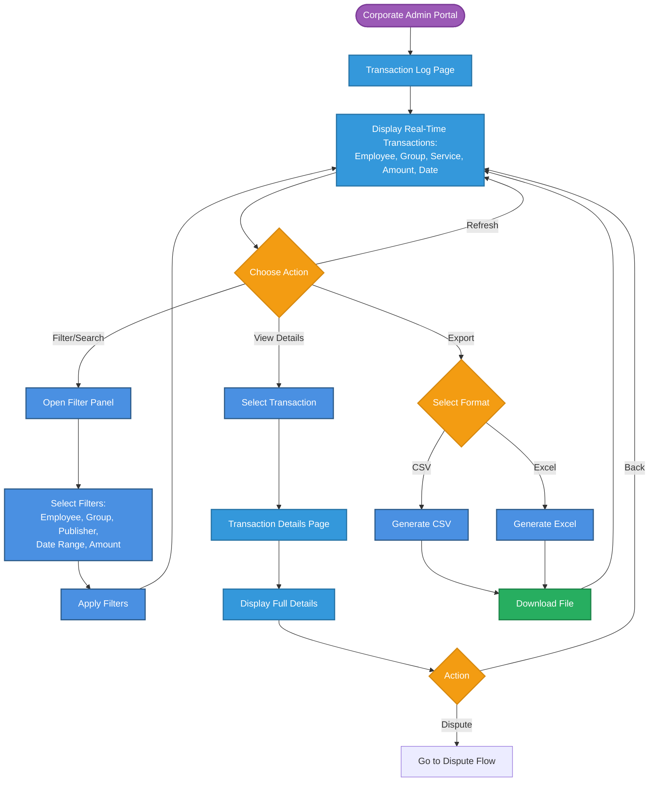
```mermaid
flowchart TD
    Start([Corporate Admin Portal]) --> TransactionLog[Transaction Log Page]
    
    TransactionLog --> ShowTransactions[Display Real-Time Transactions:<br/>Employee, Group, Service, Amount, Date]
    
    ShowTransactions --> Action{Choose Action}
    
    Action -->|Filter/Search| FilterPanel[Open Filter Panel]
    FilterPanel --> SelectFilters[Select Filters:<br/>Employee, Group, Publisher,<br/>Date Range, Amount]
    SelectFilters --> ApplyFilters[Apply Filters]
    ApplyFilters --> ShowTransactions
    
    Action -->|View Details| SelectTransaction[Select Transaction]
    SelectTransaction --> TransactionDetails[Transaction Details Page]
    TransactionDetails --> ShowDetails[Display Full Details]
    ShowDetails --> DetailAction{Action}
    DetailAction -->|Dispute| GoToDispute[Go to Dispute Flow]
    DetailAction -->|Back| ShowTransactions
    
    Action -->|Export| SelectFormat{Select Format}
    SelectFormat -->|CSV| ExportCSV[Generate CSV]
    SelectFormat -->|Excel| ExportExcel[Generate Excel]
    ExportCSV --> DownloadFile[Download File]
    ExportExcel --> DownloadFile
    DownloadFile --> ShowTransactions
    
    Action -->|Refresh| ShowTransactions
    
    classDef startStyle fill:#9B59B6,stroke:#7D3C98,stroke-width:2px,color:#fff
    classDef viewStyle fill:#3498DB,stroke:#2874A6,stroke-width:2px,color:#fff
    classDef processStyle fill:#4A90E2,stroke:#2E5C8A,stroke-width:2px,color:#fff
    classDef decisionStyle fill:#F39C12,stroke:#D68910,stroke-width:2px,color:#fff
    classDef successStyle fill:#27AE60,stroke:#1E8449,stroke-width:2px,color:#fff
    
    class Start startStyle
    class TransactionLog,ShowTransactions,TransactionDetails,ShowDetails viewStyle
    class FilterPanel,SelectFilters,ApplyFilters,SelectTransaction,ExportCSV,ExportExcel processStyle
    class Action,SelectFormat,DetailAction decisionStyle
    class DownloadFile successStyle
```
### 4.10. Flow 10: Flow 2: Current Billing Cycle Monitoring

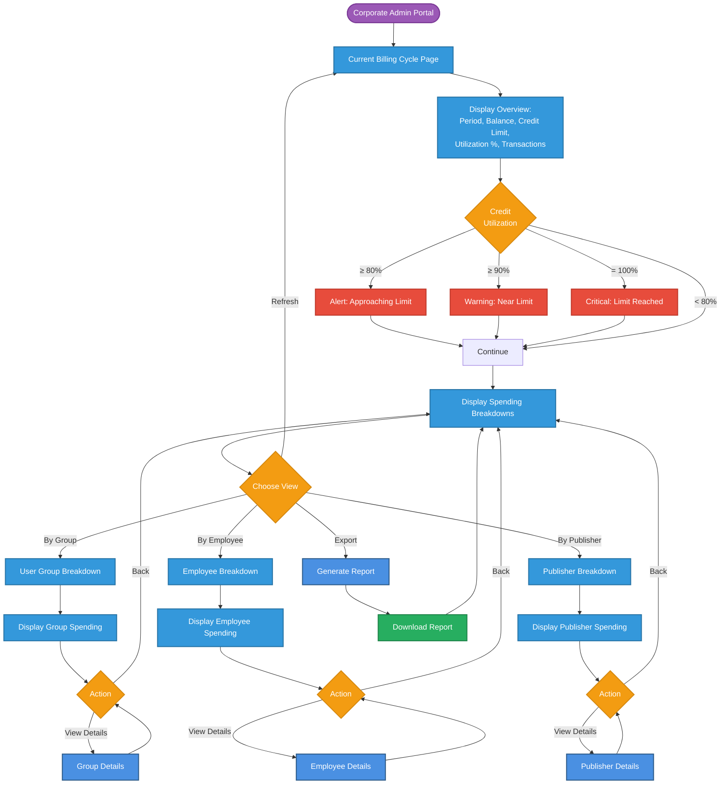
```mermaid
flowchart TD
    Start([Corporate Admin Portal]) --> BillingCycle[Current Billing Cycle Page]
    
    BillingCycle --> ShowOverview[Display Overview:<br/>Period, Balance, Credit Limit,<br/>Utilization %, Transactions]
    
    ShowOverview --> CheckUtilization{Credit<br/>Utilization}
    CheckUtilization -->|≥ 80%| ShowAlert[Alert: Approaching Limit]
    CheckUtilization -->|≥ 90%| ShowWarning[Warning: Near Limit]
    CheckUtilization -->|= 100%| ShowCritical[Critical: Limit Reached]
    ShowAlert --> ContinueView[Continue]
    ShowWarning --> ContinueView
    ShowCritical --> ContinueView
    CheckUtilization -->|< 80%| ContinueView
    
    ContinueView --> ShowBreakdowns[Display Spending Breakdowns]
    ShowBreakdowns --> Action{Choose View}
    
    Action -->|By Group| GroupBreakdown[User Group Breakdown]
    GroupBreakdown --> ShowGroups[Display Group Spending]
    ShowGroups --> GroupAction{Action}
    GroupAction -->|View Details| GroupDetails[Group Details]
    GroupDetails --> GroupAction
    GroupAction -->|Back| ShowBreakdowns
    
    Action -->|By Employee| EmployeeBreakdown[Employee Breakdown]
    EmployeeBreakdown --> ShowEmployees[Display Employee Spending]
    ShowEmployees --> EmployeeAction{Action}
    EmployeeAction -->|View Details| EmployeeDetails[Employee Details]
    EmployeeDetails --> EmployeeAction
    EmployeeAction -->|Back| ShowBreakdowns
    
    Action -->|By Publisher| PublisherBreakdown[Publisher Breakdown]
    PublisherBreakdown --> ShowPublishers[Display Publisher Spending]
    ShowPublishers --> PublisherAction{Action}
    PublisherAction -->|View Details| PublisherDetails[Publisher Details]
    PublisherDetails --> PublisherAction
    PublisherAction -->|Back| ShowBreakdowns
    
    Action -->|Export| ExportCycle[Generate Report]
    ExportCycle --> DownloadReport[Download Report]
    DownloadReport --> ShowBreakdowns
    
    Action -->|Refresh| BillingCycle
    
    classDef startStyle fill:#9B59B6,stroke:#7D3C98,stroke-width:2px,color:#fff
    classDef viewStyle fill:#3498DB,stroke:#2874A6,stroke-width:2px,color:#fff
    classDef processStyle fill:#4A90E2,stroke:#2E5C8A,stroke-width:2px,color:#fff
    classDef decisionStyle fill:#F39C12,stroke:#D68910,stroke-width:2px,color:#fff
    classDef alertStyle fill:#E74C3C,stroke:#C0392B,stroke-width:2px,color:#fff
    classDef successStyle fill:#27AE60,stroke:#1E8449,stroke-width:2px,color:#fff
    
    class Start startStyle
    class BillingCycle,ShowOverview,ShowBreakdowns,GroupBreakdown,ShowGroups,EmployeeBreakdown,ShowEmployees,PublisherBreakdown,ShowPublishers viewStyle
    class ExportCycle,GroupDetails,EmployeeDetails,PublisherDetails processStyle
    class Action,GroupAction,EmployeeAction,PublisherAction,CheckUtilization decisionStyle
    class ShowAlert,ShowWarning,ShowCritical alertStyle
    class DownloadReport successStyle
```

### 4.11. Flow 11: Monthly Statement & Payment Tracking

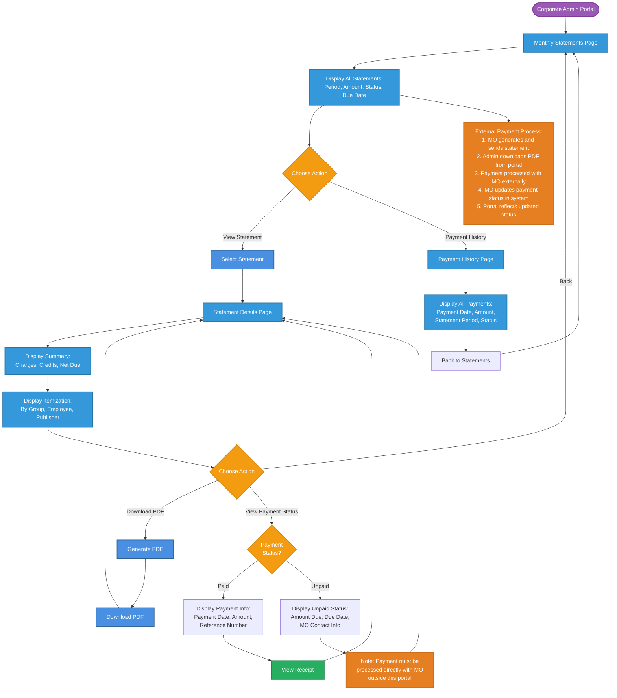
```mermaid
flowchart TD
    Start([Corporate Admin Portal]) --> StatementList[Monthly Statements Page]
    
    StatementList --> ShowList[Display All Statements:<br/>Period, Amount, Status, Due Date]
    
    ShowList --> ListAction{Choose Action}
    
    ListAction -->|View Statement| SelectStatement[Select Statement]
    SelectStatement --> StatementDetails[Statement Details Page]
    
    StatementDetails --> ShowSummary[Display Summary:<br/>Charges, Credits, Net Due]
    
    ShowSummary --> ShowItemization[Display Itemization:<br/>By Group, Employee, Publisher]
    
    ShowItemization --> StatementAction{Choose Action}
    
    StatementAction -->|Download PDF| GeneratePDF[Generate PDF]
    GeneratePDF --> DownloadPDF[Download PDF]
    DownloadPDF --> StatementDetails
    
    StatementAction -->|View Payment Status| CheckStatus{Payment<br/>Status?}
    CheckStatus -->|Paid| ShowPaid[Display Payment Info:<br/>Payment Date, Amount,<br/>Reference Number]
    ShowPaid --> ViewReceipt[View Receipt]
    ViewReceipt --> StatementDetails
    
    CheckStatus -->|Unpaid| ShowUnpaid[Display Unpaid Status:<br/>Amount Due, Due Date,<br/>MO Contact Info]
    ShowUnpaid --> PaymentNote[Note: Payment must be<br/>processed directly with MO<br/>outside this portal]
    PaymentNote --> StatementDetails
    
    ListAction -->|Payment History| PaymentHistory[Payment History Page]
    PaymentHistory --> ShowHistory[Display All Payments:<br/>Payment Date, Amount,<br/>Statement Period, Status]
    ShowHistory --> BackToList[Back to Statements]
    BackToList --> StatementList
    
    StatementAction -->|Back| StatementList
    
    ShowList --> ProcessNote[External Payment Process:<br/>1. MO generates and sends statement<br/>2. Admin downloads PDF from portal<br/>3. Payment processed with MO externally<br/>4. MO updates payment status in system<br/>5. Portal reflects updated status]
    
    classDef startStyle fill:#9B59B6,stroke:#7D3C98,stroke-width:2px,color:#fff
    classDef viewStyle fill:#3498DB,stroke:#2874A6,stroke-width:2px,color:#fff
    classDef processStyle fill:#4A90E2,stroke:#2E5C8A,stroke-width:2px,color:#fff
    classDef decisionStyle fill:#F39C12,stroke:#D68910,stroke-width:2px,color:#fff
    classDef successStyle fill:#27AE60,stroke:#1E8449,stroke-width:2px,color:#fff
    classDef noteStyle fill:#E67E22,stroke:#CA6F1E,stroke-width:2px,color:#fff
    
    class Start startStyle
    class StatementList,ShowList,StatementDetails,ShowSummary,ShowItemization,PaymentHistory,ShowHistory viewStyle
    class SelectStatement,GeneratePDF,DownloadPDF processStyle
    class ListAction,StatementAction,CheckStatus decisionStyle
    class ViewReceipt successStyle
    class PaymentNote,ProcessNote noteStyle
```

### 4.12. Flow 12: Employee Dispute Submission (via mPass App)

This flow details how a dispute is initiated by employees and automatically handled.

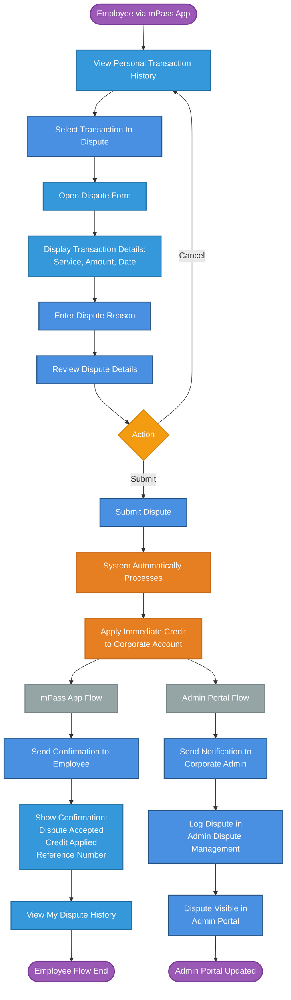
```mermaid
flowchart TD
    Start([Employee via mPass App]) --> ViewTransactions[View Personal Transaction History]
    
    ViewTransactions --> SelectTransaction[Select Transaction to Dispute]
    
    SelectTransaction --> DisputeForm[Open Dispute Form]
    
    DisputeForm --> ShowTransInfo[Display Transaction Details:<br/>Service, Amount, Date]
    
    ShowTransInfo --> EnterReason[Enter Dispute Reason]
    
    EnterReason --> ReviewDispute[Review Dispute Details]
    
    ReviewDispute --> ConfirmAction{Action}
    ConfirmAction -->|Cancel| ViewTransactions
    ConfirmAction -->|Submit| SubmitDispute[Submit Dispute]
    
    SubmitDispute --> AutoProcess[System Automatically Processes]
    
    AutoProcess --> ApplyCredit[Apply Immediate Credit<br/>to Corporate Account]
    
    %% Employee App
    ApplyCredit --> EmployeeBranch[mPass App Flow]
    EmployeeBranch --> NotifyEmployee[Send Confirmation to Employee]
    NotifyEmployee --> ShowConfirmation[Show Confirmation:<br/>Dispute Accepted<br/>Credit Applied<br/>Reference Number]
    ShowConfirmation --> ViewDisputeHistory[View My Dispute History]
    ViewDisputeHistory --> EmployeeEnd([Employee Flow End])
    
    %% Admin Portal
    ApplyCredit --> AdminBranch[Admin Portal Flow]
    AdminBranch --> NotifyAdmin[Send Notification to<br/>Corporate Admin]
    NotifyAdmin --> LogDispute[Log Dispute in<br/>Admin Dispute Management]
    LogDispute --> UpdateAdminView[Dispute Visible in<br/>Admin Portal]
    UpdateAdminView --> AdminEnd([Admin Portal Updated])
    
    classDef startStyle fill:#9B59B6,stroke:#7D3C98,stroke-width:2px,color:#fff
    classDef viewStyle fill:#3498DB,stroke:#2874A6,stroke-width:2px,color:#fff
    classDef processStyle fill:#4A90E2,stroke:#2E5C8A,stroke-width:2px,color:#fff
    classDef decisionStyle fill:#F39C12,stroke:#D68910,stroke-width:2px,color:#fff
    classDef successStyle fill:#27AE60,stroke:#1E8449,stroke-width:2px,color:#fff
    classDef systemStyle fill:#E67E22,stroke:#CA6F1E,stroke-width:2px,color:#fff
    classDef branchStyle fill:#95A5A6,stroke:#7F8C8D,stroke-width:2px,color:#fff
    
    class Start,EmployeeEnd,AdminEnd startStyle
    class ViewTransactions,DisputeForm,ShowTransInfo,ShowConfirmation,ViewDisputeHistory viewStyle
    class SelectTransaction,EnterReason,ReviewDispute,SubmitDispute,NotifyEmployee,NotifyAdmin,LogDispute,UpdateAdminView processStyle
    class ConfirmAction decisionStyle
    class Split,EmployeeBranch,AdminBranch branchStyle
    class AutoProcess,ApplyCredit,UpdateCTS systemStyle
```

### 4.13. Flow 13: Corporate Admin Dispute Submission

This flow details how a dispute is initiated by corporate admin and automatically handled.


```mermaid
flowchart TD
    Start([Corporate Admin Portal]) --> EntryPoint{Entry Point}
    
    EntryPoint -->|From Transaction Log| TransactionLog[Company Transaction Log]
    EntryPoint -->|From Dispute Log| DisputeLog[Dispute Management Page]
    
    TransactionLog --> SelectTransaction[Select Transaction to Dispute]
    DisputeLog --> SubmitNew[Submit New Dispute]
    SubmitNew --> SelectTransaction
    
    SelectTransaction --> DisputeForm[Open Dispute Form]
    
    DisputeForm --> ShowTransInfo[Display Transaction Details:<br/>Employee, Service, Amount, Date]
    
    ShowTransInfo --> EnterReason[Enter Dispute Reason]
    
    EnterReason --> ReviewDispute[Review Dispute Details]
    
    ReviewDispute --> ConfirmAction{Action}
    ConfirmAction -->|Cancel| TransactionLog
    ConfirmAction -->|Submit| SubmitDispute[Submit Dispute]
    
    SubmitDispute --> AutoProcess[System Automatically Processes]
    
    AutoProcess --> ApplyCredit[Apply Immediate Credit<br/>to Corporate Account]
    
    ApplyCredit --> UpdateCTS[Update Corporate Trust Score]
    
    UpdateCTS --> NotifyAdmin[Send Confirmation to Admin]
    
    NotifyAdmin --> NotifyEmployee[Notify Affected Employee<br/>if applicable]
    
    NotifyEmployee --> LogDispute[Log Dispute in System]
    
    LogDispute --> DisputeComplete[Dispute Complete]
    
    DisputeComplete --> ShowConfirmation[Show Confirmation:<br/>Dispute Accepted<br/>Credit Applied<br/>Reference Number]
    
    ShowConfirmation --> ViewDisputeLog[View Dispute Log]
    
    ViewDisputeLog --> End([End])
    
    classDef startStyle fill:#9B59B6,stroke:#7D3C98,stroke-width:2px,color:#fff
    classDef viewStyle fill:#3498DB,stroke:#2874A6,stroke-width:2px,color:#fff
    classDef processStyle fill:#4A90E2,stroke:#2E5C8A,stroke-width:2px,color:#fff
    classDef decisionStyle fill:#F39C12,stroke:#D68910,stroke-width:2px,color:#fff
    classDef successStyle fill:#27AE60,stroke:#1E8449,stroke-width:2px,color:#fff
    classDef systemStyle fill:#E67E22,stroke:#CA6F1E,stroke-width:2px,color:#fff
    
    class Start,End startStyle
    class TransactionLog,DisputeLog,DisputeForm,ShowTransInfo,ShowConfirmation,ViewDisputeLog viewStyle
    class SelectTransaction,SubmitNew,EnterReason,ReviewDispute,SubmitDispute,NotifyAdmin,NotifyEmployee,LogDispute processStyle
    class EntryPoint,ConfirmAction decisionStyle
    class DisputeComplete successStyle
    class AutoProcess,ApplyCredit,UpdateCTS systemStyle
```
### 4.14. Flow 14: Corporate Admin Dispute Monitoring & Reporting

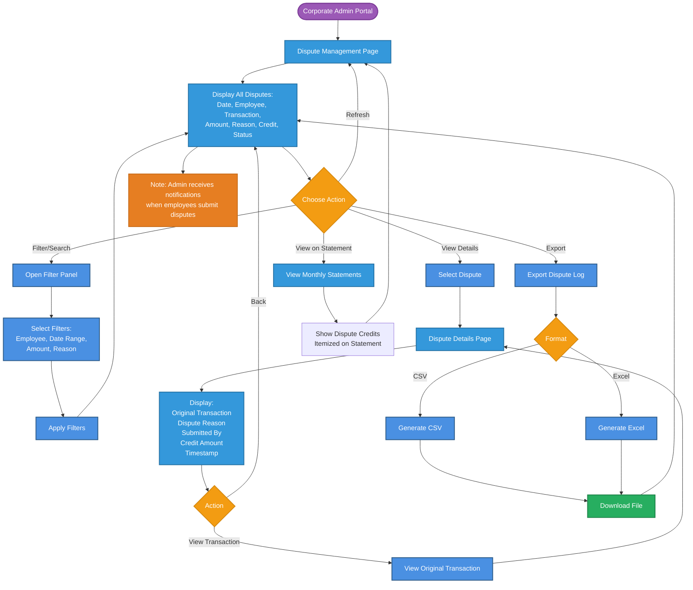
```mermaid
flowchart TD
    Start([Corporate Admin Portal]) --> DisputeLog[Dispute Management Page]
    
    DisputeLog --> ShowAllDisputes[Display All Disputes:<br/>Date, Employee, Transaction,<br/>Amount, Reason, Credit, Status]
    
    ShowAllDisputes --> Action{Choose Action}
    
    Action -->|Filter/Search| FilterPanel[Open Filter Panel]
    FilterPanel --> SelectFilters[Select Filters:<br/>Employee, Date Range,<br/>Amount, Reason]
    SelectFilters --> ApplyFilters[Apply Filters]
    ApplyFilters --> ShowAllDisputes
    
    Action -->|View Details| SelectDispute[Select Dispute]
    SelectDispute --> DisputeDetails[Dispute Details Page]
    DisputeDetails --> ShowDetails[Display:<br/>Original Transaction<br/>Dispute Reason<br/>Submitted By<br/>Credit Amount<br/>Timestamp]
    ShowDetails --> DetailAction{Action}
    DetailAction -->|View Transaction| ViewTransaction[View Original Transaction]
    DetailAction -->|Back| ShowAllDisputes
    ViewTransaction --> DisputeDetails
    
    Action -->|Export| ExportDisputes[Export Dispute Log]
    ExportDisputes --> SelectFormat{Format}
    SelectFormat -->|CSV| GenerateCSV[Generate CSV]
    SelectFormat -->|Excel| GenerateExcel[Generate Excel]
    GenerateCSV --> DownloadFile[Download File]
    GenerateExcel --> DownloadFile
    DownloadFile --> ShowAllDisputes
    
    Action -->|View on Statement| StatementView[View Monthly Statements]
    StatementView --> ShowStatementCredits[Show Dispute Credits<br/>Itemized on Statement]
    ShowStatementCredits --> DisputeLog
    
    Action -->|Refresh| DisputeLog
    
    ShowAllDisputes --> AlertNote[Note: Admin receives notifications<br/>when employees submit disputes]
    
    classDef startStyle fill:#9B59B6,stroke:#7D3C98,stroke-width:2px,color:#fff
    classDef viewStyle fill:#3498DB,stroke:#2874A6,stroke-width:2px,color:#fff
    classDef processStyle fill:#4A90E2,stroke:#2E5C8A,stroke-width:2px,color:#fff
    classDef decisionStyle fill:#F39C12,stroke:#D68910,stroke-width:2px,color:#fff
    classDef successStyle fill:#27AE60,stroke:#1E8449,stroke-width:2px,color:#fff
    classDef noteStyle fill:#E67E22,stroke:#CA6F1E,stroke-width:2px,color:#fff
    
    class Start startStyle
    class DisputeLog,ShowAllDisputes,DisputeDetails,ShowDetails,StatementView viewStyle
    class FilterPanel,SelectFilters,ApplyFilters,SelectDispute,ExportDisputes,GenerateCSV,GenerateExcel,ViewTransaction processStyle
    class Action,DetailAction,SelectFormat decisionStyle
    class DownloadFile successStyle
    class AlertNote noteStyle
```

### 4.12. MO Admin Flows

#### MO Flow 1: New Enterprise Application Review

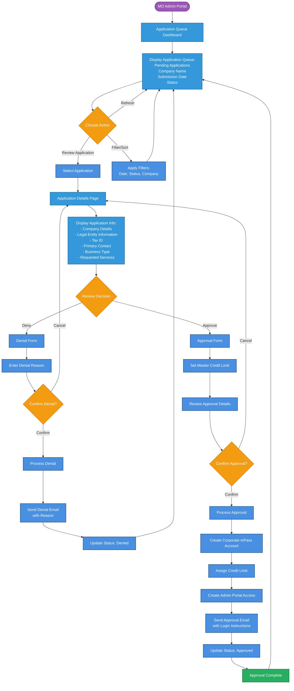
```mermaid
flowchart TD
    Start([MO Admin Portal]) --> Dashboard[Application Queue Dashboard]
    
    Dashboard --> ShowQueue[Display Application Queue:<br/>Pending Applications<br/>Company Name<br/>Submission Date<br/>Status]
    
    ShowQueue --> QueueAction{Choose Action}
    
    QueueAction -->|Review Application| SelectApp[Select Application]
    SelectApp --> AppDetails[Application Details Page]
    
    AppDetails --> ShowAppInfo[Display Application Info:<br/>- Company Details<br/>- Legal Entity Information<br/>- Tax ID<br/>- Primary Contact<br/>- Business Type<br/>- Requested Services]
    
    ShowAppInfo --> ReviewAction{Review Decision}
    
    ReviewAction -->|Deny| DenyForm[Denial Form]
    DenyForm --> EnterDenyReason[Enter Denial Reason]
    EnterDenyReason --> ConfirmDeny{Confirm Denial?}
    ConfirmDeny -->|Cancel| AppDetails
    ConfirmDeny -->|Confirm| ProcessDeny[Process Denial]
    ProcessDeny --> NotifyDenial[Send Denial Email<br/>with Reason]
    NotifyDenial --> UpdateStatus1[Update Status: Denied]
    UpdateStatus1 --> ShowQueue
    
    ReviewAction -->|Approve| ApprovalForm[Approval Form]
    ApprovalForm --> SetCreditLimit[Set Master Credit Limit]
    SetCreditLimit --> ReviewApproval[Review Approval Details]
    ReviewApproval --> ConfirmApprove{Confirm Approval?}
    ConfirmApprove -->|Cancel| AppDetails
    ConfirmApprove -->|Confirm| ProcessApproval[Process Approval]
    
    ProcessApproval --> CreateAccount[Create Corporate mPass Account]
    CreateAccount --> AssignCreditLimit[Assign Credit Limit]
    AssignCreditLimit --> CreateAdminAccess[Create Admin Portal Access]
    CreateAdminAccess --> SendApprovalEmail[Send Approval Email<br/>with Login Instructions]
    SendApprovalEmail --> UpdateStatus2[Update Status: Approved]
    UpdateStatus2 --> ApprovalComplete[Approval Complete]
    ApprovalComplete --> ShowQueue
    
    QueueAction -->|Filter/Sort| FilterQueue[Apply Filters:<br/>Date, Status, Company]
    FilterQueue --> ShowQueue
    
    QueueAction -->|Refresh| ShowQueue
    
    classDef startStyle fill:#9B59B6,stroke:#7D3C98,stroke-width:2px,color:#fff
    classDef viewStyle fill:#3498DB,stroke:#2874A6,stroke-width:2px,color:#fff
    classDef processStyle fill:#4A90E2,stroke:#2E5C8A,stroke-width:2px,color:#fff
    classDef decisionStyle fill:#F39C12,stroke:#D68910,stroke-width:2px,color:#fff
    classDef successStyle fill:#27AE60,stroke:#1E8449,stroke-width:2px,color:#fff
    classDef errorStyle fill:#E74C3C,stroke:#C0392B,stroke-width:2px,color:#fff
    
    class Start startStyle
    class Dashboard,ShowQueue,AppDetails,ShowAppInfo viewStyle
    class SelectApp,DenyForm,EnterDenyReason,ProcessDeny,NotifyDenial,ApprovalForm,SetCreditLimit,ReviewApproval,ProcessApproval,CreateAccount,AssignCreditLimit,CreateAdminAccess,SendApprovalEmail,FilterQueue processStyle
    class QueueAction,ReviewAction,ConfirmDeny,ConfirmApprove decisionStyle
    class ApprovalComplete successStyle
    class UpdateStatus1,UpdateStatus2 processStyle
```

#### MO Flow 2: Corporate Account Lifecycle Management

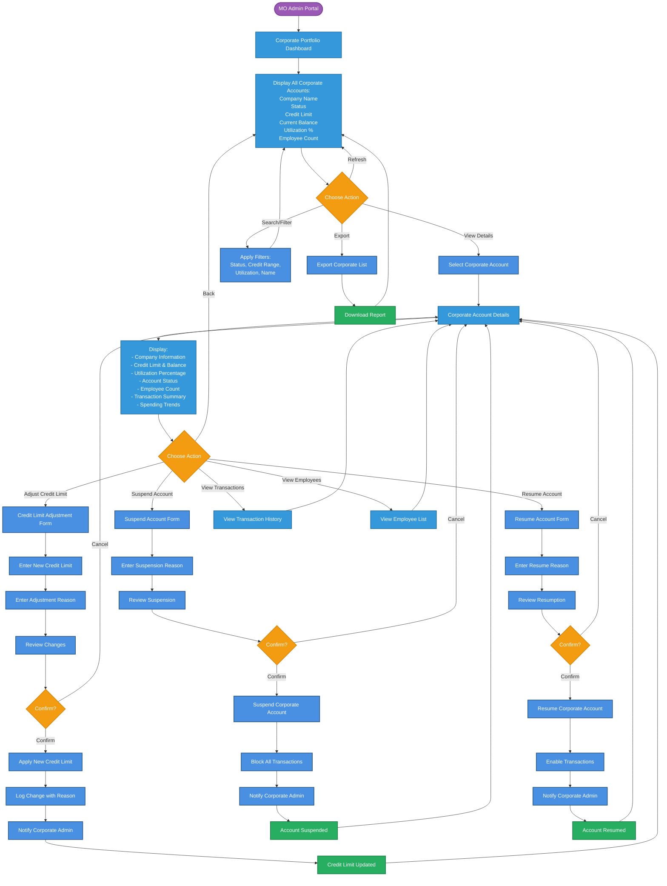
```mermaid
flowchart TD
    Start([MO Admin Portal]) --> Dashboard[Corporate Portfolio Dashboard]
    
    Dashboard --> ShowPortfolio[Display All Corporate Accounts:<br/>Company Name<br/>Status<br/>Credit Limit<br/>Current Balance<br/>Utilization %<br/>Employee Count]
    
    ShowPortfolio --> PortfolioAction{Choose Action}
    
    PortfolioAction -->|View Details| SelectCorp[Select Corporate Account]
    SelectCorp --> CorpDetails[Corporate Account Details]
    
    CorpDetails --> ShowCorpInfo[Display:<br/>- Company Information<br/>- Credit Limit & Balance<br/>- Utilization Percentage<br/>- Account Status<br/>- Employee Count<br/>- Transaction Summary<br/>- Spending Trends]
    
    ShowCorpInfo --> CorpAction{Choose Action}
    
    CorpAction -->|Adjust Credit Limit| CreditForm[Credit Limit Adjustment Form]
    CreditForm --> EnterNewLimit[Enter New Credit Limit]
    EnterNewLimit --> EnterReason[Enter Adjustment Reason]
    EnterReason --> ReviewLimit[Review Changes]
    ReviewLimit --> ConfirmLimit{Confirm?}
    ConfirmLimit -->|Cancel| CorpDetails
    ConfirmLimit -->|Confirm| ApplyLimit[Apply New Credit Limit]
    ApplyLimit --> LogLimitChange[Log Change with Reason]
    LogLimitChange --> NotifyAdmin1[Notify Corporate Admin]
    NotifyAdmin1 --> LimitSuccess[Credit Limit Updated]
    LimitSuccess --> CorpDetails
    
    CorpAction -->|Suspend Account| SuspendForm[Suspend Account Form]
    SuspendForm --> EnterSuspendReason[Enter Suspension Reason]
    EnterSuspendReason --> ReviewSuspend[Review Suspension]
    ReviewSuspend --> ConfirmSuspend{Confirm?}
    ConfirmSuspend -->|Cancel| CorpDetails
    ConfirmSuspend -->|Confirm| ProcessSuspend[Suspend Corporate Account]
    ProcessSuspend --> BlockTransactions[Block All Transactions]
    BlockTransactions --> NotifyAdmin2[Notify Corporate Admin]
    NotifyAdmin2 --> SuspendSuccess[Account Suspended]
    SuspendSuccess --> CorpDetails
    
    CorpAction -->|Resume Account| ResumeForm[Resume Account Form]
    ResumeForm --> EnterResumeReason[Enter Resume Reason]
    EnterResumeReason --> ReviewResume[Review Resumption]
    ReviewResume --> ConfirmResume{Confirm?}
    ConfirmResume -->|Cancel| CorpDetails
    ConfirmResume -->|Confirm| ProcessResume[Resume Corporate Account]
    ProcessResume --> EnableTransactions[Enable Transactions]
    EnableTransactions --> NotifyAdmin3[Notify Corporate Admin]
    NotifyAdmin3 --> ResumeSuccess[Account Resumed]
    ResumeSuccess --> CorpDetails
    
    CorpAction -->|View Transactions| ViewTrans[View Transaction History]
    ViewTrans --> CorpDetails
    
    CorpAction -->|View Employees| ViewEmployees[View Employee List]
    ViewEmployees --> CorpDetails
    
    CorpAction -->|Back| ShowPortfolio
    
    PortfolioAction -->|Search/Filter| FilterPortfolio[Apply Filters:<br/>Status, Credit Range,<br/>Utilization, Name]
    FilterPortfolio --> ShowPortfolio
    
    PortfolioAction -->|Export| ExportPortfolio[Export Corporate List]
    ExportPortfolio --> DownloadFile[Download Report]
    DownloadFile --> ShowPortfolio
    
    PortfolioAction -->|Refresh| ShowPortfolio
    
    classDef startStyle fill:#9B59B6,stroke:#7D3C98,stroke-width:2px,color:#fff
    classDef viewStyle fill:#3498DB,stroke:#2874A6,stroke-width:2px,color:#fff
    classDef processStyle fill:#4A90E2,stroke:#2E5C8A,stroke-width:2px,color:#fff
    classDef decisionStyle fill:#F39C12,stroke:#D68910,stroke-width:2px,color:#fff
    classDef successStyle fill:#27AE60,stroke:#1E8449,stroke-width:2px,color:#fff
    
    class Start startStyle
    class Dashboard,ShowPortfolio,CorpDetails,ShowCorpInfo,ViewTrans,ViewEmployees viewStyle
    class SelectCorp,CreditForm,EnterNewLimit,EnterReason,ReviewLimit,ApplyLimit,LogLimitChange,NotifyAdmin1,SuspendForm,EnterSuspendReason,ReviewSuspend,ProcessSuspend,BlockTransactions,NotifyAdmin2,ResumeForm,EnterResumeReason,ReviewResume,ProcessResume,EnableTransactions,NotifyAdmin3,FilterPortfolio,ExportPortfolio processStyle
    class PortfolioAction,CorpAction,ConfirmLimit,ConfirmSuspend,ConfirmResume decisionStyle
    class LimitSuccess,SuspendSuccess,ResumeSuccess,DownloadFile successStyle
```

#### MO Flow 3: Corporate Billing & Payment Management

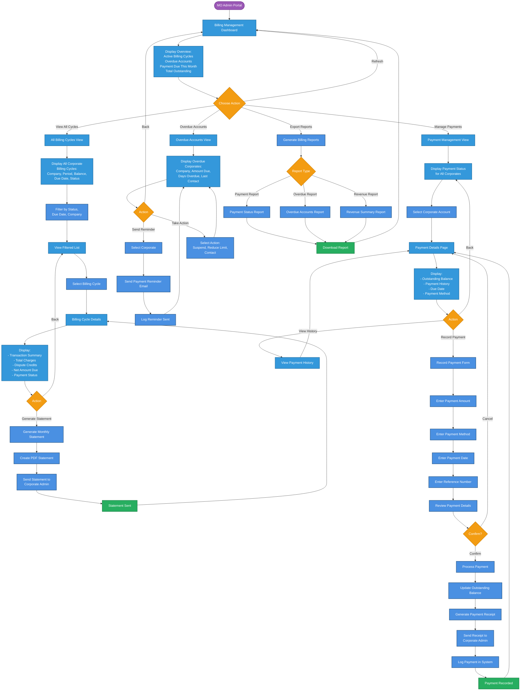
```mermaid
flowchart TD
    Start([MO Admin Portal]) --> Dashboard[Billing Management Dashboard]
    
    Dashboard --> ShowOverview[Display Overview:<br/>Active Billing Cycles<br/>Overdue Accounts<br/>Payment Due This Month<br/>Total Outstanding]
    
    ShowOverview --> BillingAction{Choose Action}
    
    BillingAction -->|View All Cycles| AllCycles[All Billing Cycles View]
    AllCycles --> ShowCycles[Display All Corporate<br/>Billing Cycles:<br/>Company, Period, Balance,<br/>Due Date, Status]
    ShowCycles --> CycleFilter[Filter by Status,<br/>Due Date, Company]
    CycleFilter --> CycleList[View Filtered List]
    CycleList --> SelectCycle[Select Billing Cycle]
    SelectCycle --> CycleDetails[Billing Cycle Details]
    CycleDetails --> ShowCycleDetail[Display:<br/>- Transaction Summary<br/>- Total Charges<br/>- Dispute Credits<br/>- Net Amount Due<br/>- Payment Status]
    ShowCycleDetail --> CycleAction{Action}
    CycleAction -->|Generate Statement| GenerateStmt[Generate Monthly Statement]
    GenerateStmt --> CreatePDF[Create PDF Statement]
    CreatePDF --> SendStatement[Send Statement to<br/>Corporate Admin]
    SendStatement --> StmtSent[Statement Sent]
    StmtSent --> CycleDetails
    CycleAction -->|Back| CycleList
    
    BillingAction -->|Manage Payments| PaymentMgmt[Payment Management View]
    PaymentMgmt --> ShowPayments[Display Payment Status<br/>for All Corporates]
    ShowPayments --> SelectPayment[Select Corporate Account]
    SelectPayment --> PaymentDetails[Payment Details Page]
    PaymentDetails --> ShowPaymentInfo[Display:<br/>- Outstanding Balance<br/>- Payment History<br/>- Due Date<br/>- Payment Method]
    ShowPaymentInfo --> PaymentAction{Action}
    
    PaymentAction -->|Record Payment| RecordForm[Record Payment Form]
    RecordForm --> EnterAmount[Enter Payment Amount]
    EnterAmount --> EnterMethod[Enter Payment Method]
    EnterMethod --> EnterDate[Enter Payment Date]
    EnterDate --> EnterRef[Enter Reference Number]
    EnterRef --> ReviewPayment[Review Payment Details]
    ReviewPayment --> ConfirmPayment{Confirm?}
    ConfirmPayment -->|Cancel| PaymentDetails
    ConfirmPayment -->|Confirm| ProcessPayment[Process Payment]
    ProcessPayment --> UpdateBalance[Update Outstanding Balance]
    UpdateBalance --> GenerateReceipt[Generate Payment Receipt]
    GenerateReceipt --> SendReceipt[Send Receipt to<br/>Corporate Admin]
    SendReceipt --> LogPayment[Log Payment in System]
    LogPayment --> PaymentSuccess[Payment Recorded]
    PaymentSuccess --> PaymentDetails
    
    PaymentAction -->|View History| ViewHistory[View Payment History]
    ViewHistory --> PaymentDetails
    
    PaymentAction -->|Back| ShowPayments
    
    BillingAction -->|Overdue Accounts| OverdueView[Overdue Accounts View]
    OverdueView --> ShowOverdue[Display Overdue Corporates:<br/>Company, Amount Due,<br/>Days Overdue, Last Contact]
    ShowOverdue --> OverdueAction{Action}
    OverdueAction -->|Send Reminder| SelectOverdue[Select Corporate]
    SelectOverdue --> SendReminder[Send Payment Reminder Email]
    SendReminder --> LogReminder[Log Reminder Sent]
    LogReminder --> ShowOverdue
    OverdueAction -->|Take Action| TakeAction[Select Action:<br/>Suspend, Reduce Limit,<br/>Contact]
    TakeAction --> ShowOverdue
    OverdueAction -->|Back| Dashboard
    
    BillingAction -->|Export Reports| ExportBilling[Generate Billing Reports]
    ExportBilling --> SelectReportType{Report Type}
    SelectReportType -->|Payment Report| PaymentReport[Payment Status Report]
    SelectReportType -->|Overdue Report| OverdueReport[Overdue Accounts Report]
    SelectReportType -->|Revenue Report| RevenueReport[Revenue Summary Report]
    PaymentReport --> DownloadReport[Download Report]
    OverdueReport --> DownloadReport
    RevenueReport --> DownloadReport
    DownloadReport --> Dashboard
    
    BillingAction -->|Refresh| Dashboard
    
    classDef startStyle fill:#9B59B6,stroke:#7D3C98,stroke-width:2px,color:#fff
    classDef viewStyle fill:#3498DB,stroke:#2874A6,stroke-width:2px,color:#fff
    classDef processStyle fill:#4A90E2,stroke:#2E5C8A,stroke-width:2px,color:#fff
    classDef decisionStyle fill:#F39C12,stroke:#D68910,stroke-width:2px,color:#fff
    classDef successStyle fill:#27AE60,stroke:#1E8449,stroke-width:2px,color:#fff
    
    class Start startStyle
    class Dashboard,ShowOverview,AllCycles,ShowCycles,CycleList,CycleDetails,ShowCycleDetail,PaymentMgmt,ShowPayments,PaymentDetails,ShowPaymentInfo,OverdueView,ShowOverdue,ViewHistory viewStyle
    class SelectCycle,GenerateStmt,CreatePDF,SendStatement,SelectPayment,RecordForm,EnterAmount,EnterMethod,EnterDate,EnterRef,ReviewPayment,ProcessPayment,UpdateBalance,GenerateReceipt,SendReceipt,LogPayment,SelectOverdue,SendReminder,LogReminder,TakeAction,ExportBilling,PaymentReport,OverdueReport,RevenueReport,CycleFilter processStyle
    class BillingAction,CycleAction,PaymentAction,ConfirmPayment,OverdueAction,SelectReportType decisionStyle
    class StmtSent,PaymentSuccess,DownloadReport successStyle
```
#### MO Flow 4: MO Admin Dispute Management

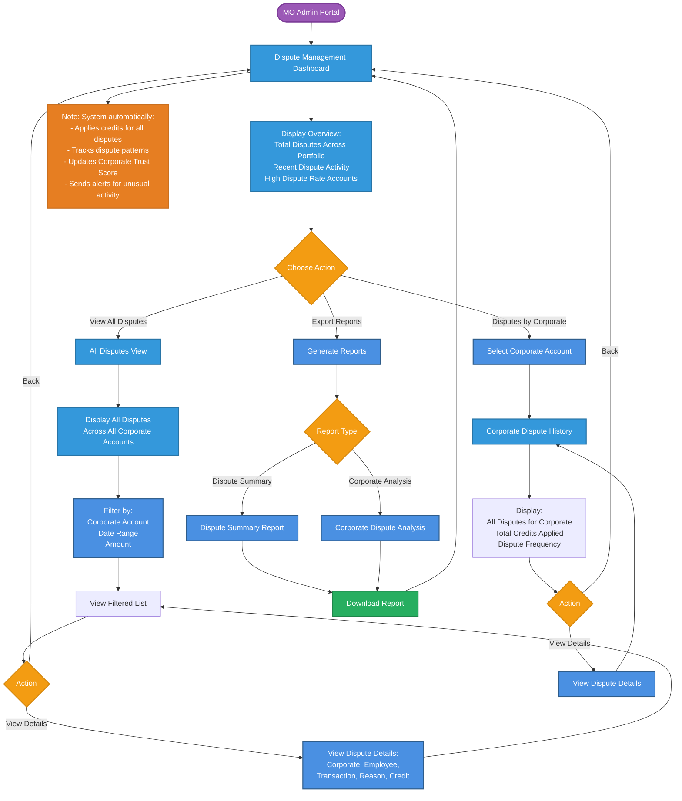
```mermaid
flowchart TD
    Start([MO Admin Portal]) --> Dashboard[Dispute Management Dashboard]
    
    Dashboard --> ShowOverview[Display Overview:<br/>Total Disputes Across Portfolio<br/>Recent Dispute Activity<br/>High Dispute Rate Accounts]
    
    ShowOverview --> Action{Choose Action}
    
    Action -->|View All Disputes| AllDisputes[All Disputes View]
    AllDisputes --> ShowAllDisputes[Display All Disputes<br/>Across All Corporate Accounts]
    ShowAllDisputes --> FilterDisputes[Filter by:<br/>Corporate Account<br/>Date Range<br/>Amount]
    FilterDisputes --> DisputeList[View Filtered List]
    DisputeList --> SelectDisputeAction{Action}
    SelectDisputeAction -->|View Details| ViewDisputeDetail[View Dispute Details:<br/>Corporate, Employee,<br/>Transaction, Reason, Credit]
    ViewDisputeDetail --> DisputeList
    SelectDisputeAction -->|Back| Dashboard
    
    Action -->|Disputes by Corporate| SelectCorporate[Select Corporate Account]
    SelectCorporate --> CorporateDisputes[Corporate Dispute History]
    CorporateDisputes --> ShowCorpDisputes[Display:<br/>All Disputes for Corporate<br/>Total Credits Applied<br/>Dispute Frequency]
    ShowCorpDisputes --> CorpDisputeAction{Action}
    CorpDisputeAction -->|View Details| ViewCorpDispute[View Dispute Details]
    ViewCorpDispute --> CorporateDisputes
    CorpDisputeAction -->|Back| Dashboard
    
    Action -->|Export Reports| ExportReports[Generate Reports]
    ExportReports --> SelectReport{Report Type}
    SelectReport -->|Dispute Summary| DisputeReport[Dispute Summary Report]
    SelectReport -->|Corporate Analysis| CorpReport[Corporate Dispute Analysis]
    DisputeReport --> DownloadReport[Download Report]
    CorpReport --> DownloadReport
    DownloadReport --> Dashboard
    
    Dashboard --> AutoNote[Note: System automatically:<br/>- Applies credits for all disputes<br/>- Tracks dispute patterns<br/>- Updates Corporate Trust Score<br/>- Sends alerts for unusual activity]
    
    classDef startStyle fill:#9B59B6,stroke:#7D3C98,stroke-width:2px,color:#fff
    classDef viewStyle fill:#3498DB,stroke:#2874A6,stroke-width:2px,color:#fff
    classDef processStyle fill:#4A90E2,stroke:#2E5C8A,stroke-width:2px,color:#fff
    classDef decisionStyle fill:#F39C12,stroke:#D68910,stroke-width:2px,color:#fff
    classDef successStyle fill:#27AE60,stroke:#1E8449,stroke-width:2px,color:#fff
    classDef noteStyle fill:#E67E22,stroke:#CA6F1E,stroke-width:2px,color:#fff
    
    class Start startStyle
    class Dashboard,ShowOverview,AllDisputes,ShowAllDisputes,CorporateDisputes viewStyle
    class FilterDisputes,SelectCorporate,ViewDisputeDetail,ViewCorpDispute,ExportReports,DisputeReport,CorpReport processStyle
    class Action,SelectDisputeAction,CorpDisputeAction,SelectReport decisionStyle
    class DownloadReport successStyle
    class AutoNote noteStyle
```
#### MO Flow 5: Employee & Group Oversight
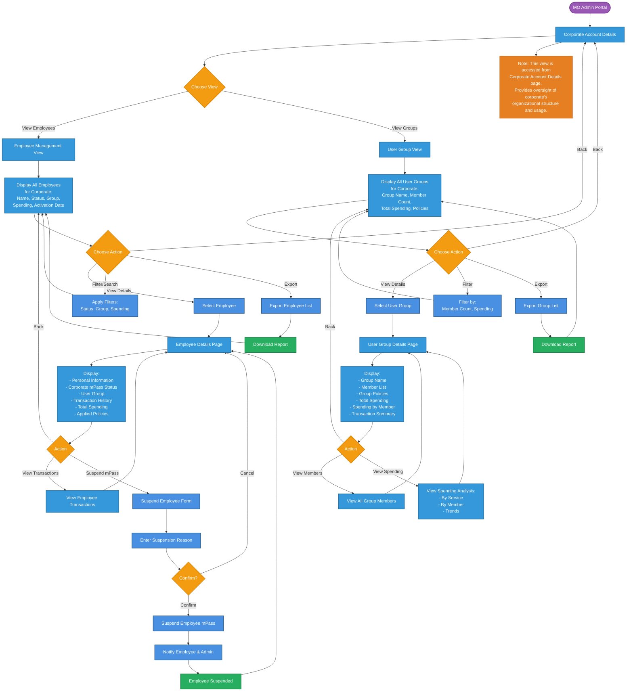
```mermaid
flowchart TD
    Start([MO Admin Portal]) --> Dashboard[Corporate Account Details]
    
    Dashboard --> ViewOption{Choose View}
    
    ViewOption -->|View Employees| EmployeeView[Employee Management View]
    EmployeeView --> ShowEmployees[Display All Employees<br/>for Corporate:<br/>Name, Status, Group,<br/>Spending, Activation Date]
    
    ShowEmployees --> EmpAction{Choose Action}
    
    EmpAction -->|View Details| SelectEmployee[Select Employee]
    SelectEmployee --> EmployeeDetails[Employee Details Page]
    EmployeeDetails --> ShowEmpDetail[Display:<br/>- Personal Information<br/>- Corporate mPass Status<br/>- User Group<br/>- Transaction History<br/>- Total Spending<br/>- Applied Policies]
    ShowEmpDetail --> EmpDetailAction{Action}
    
    EmpDetailAction -->|View Transactions| ViewEmpTrans[View Employee Transactions]
    ViewEmpTrans --> EmployeeDetails
    
    EmpDetailAction -->|Suspend mPass| SuspendForm[Suspend Employee Form]
    SuspendForm --> EnterSuspendReason[Enter Suspension Reason]
    EnterSuspendReason --> ConfirmSuspend{Confirm?}
    ConfirmSuspend -->|Cancel| EmployeeDetails
    ConfirmSuspend -->|Confirm| ProcessSuspend[Suspend Employee mPass]
    ProcessSuspend --> NotifyEmployee[Notify Employee & Admin]
    NotifyEmployee --> SuspendSuccess[Employee Suspended]
    SuspendSuccess --> EmployeeDetails
    
    EmpDetailAction -->|Back| ShowEmployees
    
    EmpAction -->|Filter/Search| FilterEmployees[Apply Filters:<br/>Status, Group, Spending]
    FilterEmployees --> ShowEmployees
    
    EmpAction -->|Export| ExportEmployees[Export Employee List]
    ExportEmployees --> DownloadEmp[Download Report]
    DownloadEmp --> ShowEmployees
    
    EmpAction -->|Back| Dashboard
    
    ViewOption -->|View Groups| GroupView[User Group View]
    GroupView --> ShowGroups[Display All User Groups<br/>for Corporate:<br/>Group Name, Member Count,<br/>Total Spending, Policies]
    
    ShowGroups --> GroupAction{Choose Action}
    
    GroupAction -->|View Details| SelectGroup[Select User Group]
    SelectGroup --> GroupDetails[User Group Details Page]
    GroupDetails --> ShowGroupDetail[Display:<br/>- Group Name<br/>- Member List<br/>- Group Policies<br/>- Total Spending<br/>- Spending by Member<br/>- Transaction Summary]
    ShowGroupDetail --> GroupDetailAction{Action}
    
    GroupDetailAction -->|View Members| ViewMembers[View All Group Members]
    ViewMembers --> GroupDetails
    
    GroupDetailAction -->|View Spending| ViewGroupSpending[View Spending Analysis:<br/>- By Service<br/>- By Member<br/>- Trends]
    ViewGroupSpending --> GroupDetails
    
    GroupDetailAction -->|Back| ShowGroups
    
    GroupAction -->|Filter| FilterGroups[Filter by:<br/>Member Count, Spending]
    FilterGroups --> ShowGroups
    
    GroupAction -->|Export| ExportGroups[Export Group List]
    ExportGroups --> DownloadGroup[Download Report]
    DownloadGroup --> ShowGroups
    
    GroupAction -->|Back| Dashboard
    
    Dashboard --> OverviewNote[Note: This view is accessed from<br/>Corporate Account Details page.<br/>Provides oversight of corporate's<br/>organizational structure and usage.]
    
    classDef startStyle fill:#9B59B6,stroke:#7D3C98,stroke-width:2px,color:#fff
    classDef viewStyle fill:#3498DB,stroke:#2874A6,stroke-width:2px,color:#fff
    classDef processStyle fill:#4A90E2,stroke:#2E5C8A,stroke-width:2px,color:#fff
    classDef decisionStyle fill:#F39C12,stroke:#D68910,stroke-width:2px,color:#fff
    classDef successStyle fill:#27AE60,stroke:#1E8449,stroke-width:2px,color:#fff
    classDef noteStyle fill:#E67E22,stroke:#CA6F1E,stroke-width:2px,color:#fff
    
    class Start startStyle
    class Dashboard,EmployeeView,ShowEmployees,EmployeeDetails,ShowEmpDetail,ViewEmpTrans,GroupView,ShowGroups,GroupDetails,ShowGroupDetail,ViewMembers,ViewGroupSpending viewStyle
    class SelectEmployee,SuspendForm,EnterSuspendReason,ProcessSuspend,NotifyEmployee,FilterEmployees,ExportEmployees,SelectGroup,FilterGroups,ExportGroups processStyle
    class ViewOption,EmpAction,EmpDetailAction,ConfirmSuspend,GroupAction,GroupDetailAction decisionStyle
    class SuspendSuccess,DownloadEmp,DownloadGroup successStyle
    class OverviewNote noteStyle
```

## 5. Wireframes

This section provides low-fidelity wireframes for the key screens and interactive components of the Corporate Admin Portal.

### 5.1. Onboarding & Authentication

#### Wireframe: Corporate mPass Application Form

-   **Purpose**: To allow a new enterprise to apply for the Corporate mPass service.

[Corporate mPass Registration Page](https://raw.githubusercontent.com/diemnguyen944/test_repo/refs/heads/po/docs/assets/Screenshot%202025-10-22%20at%2011.17.47.png)

#### Wireframe: Employee Invitation Email
-   **Purpose**: To allow a employee to apply for the Individual Corporate mPass service.

[Employee Invitation Email](https://raw.githubusercontent.com/diemnguyen944/test_repo/refs/heads/po/docs/assets/Screenshot%202025-10-22%20at%2011.26.49.png)

### 5.2. Corporate Admin Portal

#### Wireframe: Enterprise Admin Portal - Main Dashboard

-   **Purpose**: To provide a high-level overview of account activity and quick access to common tasks upon login.

[Enterprise Admin Portal - Main Dashboard](https://raw.githubusercontent.com/diemnguyen944/test_repo/refs/heads/po/docs/assets/Screenshot%202025-10-22%20at%2011.27.10.png)

#### Wireframe: Enterprise Admin Portal - User Management Page

-   **Purpose**: To provide a central place for admins to view, search, and manage all employees (both active and pending).

[Enterprise Admin Portal - User Management Page](https://raw.githubusercontent.com/diemnguyen944/test_repo/refs/heads/po/docs/assets/Screenshot%202025-10-22%20at%2011.27.27.png)


### 5.3. User Management Modals & Pages

#### Wireframe: User Detail Page

-   **Purpose**: To provide a comprehensive, read-only view of an employee's status, permissions, and activity, as well as a launch point for individual actions.
-   **Layout**: A two-column layout with summary information on the left and detailed activity logs in a tabbed interface on the right.

```
+--------------------------------------------------------------------------------------+
| [Logo]            | [Header: User Details]                                             |
|                   |  < Back to User Management                                         |
|-------------------|--------------------------------------------------------------------|
| NAVIGATION        |  [Section: John Smith] [Status: Active]                            |
| (...)             |   john.smith@company.com                                           |
|                   |   Member Since: Oct 22, 2024                                       |
|                   |                                    [ Suspend User ] [ Edit User ]  |
|                   |--------------------------------------------------------------------|
|                   |                                                                    |
|                   |  [Card: Groups (1)]         |   [  Transactions  ] [  Policy  ]      |
|                   |   - Sales                   |------------------------------------|
|                   |                             |                                    |
|                   |  [Card: MTD Spend]          |   [Transaction History Table]      |
|                   |   - $450.00 / $1000.00      |   List of recent transactions...   |
|                   |                             |                                    |
|                   |                             |                                    |
+--------------------------------------------------------------------------------------+
```

#### Wireframe: Invite Employee Modal (Single)

-   **Purpose**: A quick, focused form for inviting one employee at a time.

```
+--------------------------------------------------+
| Invite Employee                              [X] |
|--------------------------------------------------|
|                                                  |
|   [ Email Address*         ]                     |
|                                                  |
|   [ Assign to Group(s) (Optional)   v ]          |
|    - [x] Engineering                             |
|    - [ ] Marketing                               |
|                                                  |
|                         [Cancel] [Send Invite]   |
+--------------------------------------------------+
```

#### Wireframe: Invite Employees Modal (Bulk)

-   **Purpose**: A two-step process for uploading a CSV of multiple employees.

```
+--------------------------------------------------+
| Invite Employees (Bulk)                        [X] |
|--------------------------------------------------|
|  Step 1: Upload File                             |
|   Download our [template.csv] to get started.    |
|                                                  |
|   [ Drag & Drop CSV here or Click to Browse ]    |
|                                                  |
|  Step 2: Preview & Confirm (disabled)            |
|                                                  |
|                         [Cancel] [Next >]        |
+--------------------------------------------------+
```

#### Wireframe: User Groups Main Page

-   **Purpose**: To list all created user groups and provide entry points for managing them.
-   **Layout**: A card-based view that provides key information at a glance.

```
+--------------------------------------------------------------------------------------+
| [Logo]            | [Header: User Groups]                                              |
|-------------------|--------------------------------------------------------------------|
| NAVIGATION        |                                                                    |
| -> Dashboard      |  [Search groups...]                           [Create New Group]   |
| -> User Mgmt      |--------------------------------------------------------------------|
| -> ...            |                                                                    |
|                   |  [Card: Engineering]     [Card: Marketing]     [Card: Sales]       |
|                   |   - 75 Members           - 22 Members          - 35 Members        |
|                   |   - Policy: Default     - Policy: Custom    |
|                   |   - [...]                - [...]               - [...]             |
|                   |                                                                    |
+--------------------------------------------------------------------------------------+
```

#### Wireframe: User Group Detail Page

-   **Purpose**: To provide a detailed view of a specific group, its members, its assigned policies, and its spending activity. This is the admin's primary interface for managing a department.
-   **Layout**: A summary header with key stats and a tabbed interface to switch between managing members and managing the group's policy.

```
+--------------------------------------------------------------------------------------+
| [Logo]            | [Header: Group Details]                                            |
|                   |  < Back to User Groups                                             |
|-------------------|--------------------------------------------------------------------|
| NAVIGATION        |  [Section: Engineering] [75 Members]       [ Edit Name ] [ Delete ]|
| (...)             |--------------------------------------------------------------------|
|                   |                                                                    |
|                   |  [Card: Group MTD Spend]    [Card: Group Policy]                   |
|                   |   - $8,210 / $15,000        - Custom (Inherits 2/3 company rules)  |
|                   |                                                                    |
|                   |--------------------------------------------------------------------|
|                   |                                                                    |
|                   |  [   Members (75)   ]  [   Group Policy   ]                         |
|                   |--------------------------------------------------------------------|
|                   |                                                                    |
|                   |   [User Data Table for this group]                                 |
|                   |   Showing members of the Engineering group...                      |
|                   |                                                                    |
+--------------------------------------------------------------------------------------+
```

#### Wireframe: Manage Group Membership Page/Modal

-   **Purpose**: To allow admins to easily add and remove users from a specific group.
-   **Layout**: A dual-list (or "picklist") pattern, which is the standard and most intuitive UI for this task.

```
+------------------------------------------------------------------+
| Manage Members: Engineering                                    [X] |
|------------------------------------------------------------------|
|                                                                  |
| [Available Employees (25)]      [<]      [Group Members (75)]    |
| [Search...]                     [>]      [Search...]             |
| +-------------------------+              +---------------------+ |
| | [ ] Alex Green          |              | [x] Barry White     | |
| | [ ] Brenda Blue         |              | [x] Chris Black     | |
| | ...                     |              | ...                 | |
| +-------------------------+              +---------------------+ |
|                                                                  |
|                                       [Cancel] [Save Changes]    |
+------------------------------------------------------------------+
```

### 5.4. Policy Management

#### Wireframe: Policy Management Main Page

-   **Purpose**: A unified interface to manage all company-wide, group, and individual policies. Each level includes its own contextual change history.
-   **Layout**: A tabbed interface to separate the three levels of the policy hierarchy.

```
+--------------------------------------------------------------------------------------+
| [Logo]            | [Header: Policy Management]                                        |
|-------------------|--------------------------------------------------------------------|
| NAVIGATION        |                                                                    |
| -> Dashboard      |  [  Company-Wide  ]  [   Groups   ]  [  Individuals  ]             |
| -> ...            |--------------------------------------------------------------------|
|                   |                                                                    |
|                   | [Section: Company-Wide Policy]                                     |
|                   |  [Card: Global Spending Limit]             ( Edit ) ( View History ) |
|                   |   - Monthly Limit: $50,000                                         |
|                   |  [Card: Global Service Access]             ( Edit ) ( View History ) |
|                   |   - Allowed: Business Tools | Blocked: Netflix, Spotify            |
|                   |                                                                    |
+--------------------------------------------------------------------------------------+
```

### 5.5. Billing & Reporting

#### Wireframe: Billing & Reporting Page (Statements Tab)

-   **Purpose**: To provide a clear history of all monthly statements and allow for easy viewing and downloading.
-   **Layout**: A clean data table listing all statements chronologically.

```
+--------------------------------------------------------------------------------------+
| [Logo]            | [Header: Billing & Reporting]                                      |
|-------------------|--------------------------------------------------------------------|
| NAVIGATION        |                                                                    |
| -> Dashboard      |  [ Transaction Log ]  [  Statements  ]  [  Reports  ]              |
| -> ...            |--------------------------------------------------------------------|
|                   |                                                                    |
|                   |  [Statements Table]                                                |
|                   |  +---------------+--------------+------------+----------+---------+ |
|                   |  | Period        | Total Amount | Status     | Due Date | Actions | |
|                   |  +---------------+--------------+------------+----------+---------+ |
|                   |  | Nov 1-30, 2024| $12,450.78   | [Paid]     | 12/15/24 | [View]  | |
|                   |  | Oct 1-31, 2024| $11,980.12   | [Paid]     | 11/15/24 | [View]  | |
|                   |  +---------------+--------------+------------+----------+---------+ |
|                   |                                                                    |
+--------------------------------------------------------------------------------------+
```

### 5.6. Dispute Management

#### Wireframe: Dispute Management Page

-   **Purpose**: A comprehensive view of all disputes, their statuses, and associated details.
-   **Layout**: A data table with filtering and search capabilities.

```
+--------------------------------------------------------------------------------------+
| [Logo]            | [Header: Dispute Management]                                       |
|-------------------|--------------------------------------------------------------------|
| NAVIGATION        |                                                                    |
| -> Dashboard      |  [Search Bar]                    [Filter] [Export]                 |
| -> ...            |--------------------------------------------------------------------|
|                   |                                                                    |
|                   |  [Dispute Log Table]                                               |
|                   |  +------------+----------+-----------+-------------+---------------+ |
|                   |  | Status     | Employee | Amount    | Date        | Action        | |
|                   |  +------------+----------+-----------+-------------+---------------+ |
|                   |  | [Compensated] | John S.  | $45.00    | Dec 15, 2024| [View Details]| |
|                   |  +------------+----------+-----------+-------------+---------------+ |
|                   |                                                                    |
+--------------------------------------------------------------------------------------+
```

#### Wireframe: View Dispute Details Modal

-   **Purpose**: To provide all relevant information about a specific dispute in a scannable format.

```
+------------------------------------------------------------------+
| Dispute Details                                              [X] |
|------------------------------------------------------------------|
|                                                                  |
|  [Dispute Information]                                           |
|   - Status: Compensated                                          |
|   - Employee: John Smith (john.smith@company.com)                |
|                                                                  |
|  [Original Transaction Details]                                  |
|   - Service: Adobe Creative Cloud | Amount: $45.00               |
|                                                                  |
|  [Employee Notes]                                                |
|   "I was charged twice for the same service."                    |
|                                                                  |
|                                       [View Transaction] [Close] |
+------------------------------------------------------------------+
```

## 6. Component Library

A consistent and reusable component library is essential for building the Enterprise Admin Portal efficiently and ensuring a cohesive user experience. This library will be the single source of truth for all UI elements.

### 5.1. Strategy: Theming & White-Labeling

The portal must be themeable to align with the branding of different Membership Organizations (MOs). Our strategy will be:

-   **CSS Variables**: All core style values (colors, fonts, spacing, etc.) will be defined as CSS variables.
-   **Theme Files**: Each MO can be provided with a simple CSS file that overrides these variables to apply their brand. This allows for extensive visual customization without touching the underlying component logic.
-   **Default Theme**: A clean, professional Moneta Network theme will be provided as the default.

### 5.2. Core Components

This is an initial list of components required to build the wireframed pages.

| Component             | Description                                                                                             | Used In                                                                  |
| --------------------- | ------------------------------------------------------------------------------------------------------- | ------------------------------------------------------------------------ |
| **Button**            | Primary, Secondary, Tertiary, and Destructive (e.g., Delete) styles. Supports icons.                     | Everywhere (e.g., "Invite Employee", "Create Group", "Save Policy")      |
| **Input Field**       | Standard text, email, number, and password inputs with validation states (error, success).              | Login, Registration, Invite Modals, Policy Forms                         |
| **Modal**             | A flexible modal container for dialogs, confirmations, and forms.                                       | Invite Employee, Create Group, Confirmation Dialogs                      |
| **Data Table**        | A robust table component with support for sorting, filtering, pagination, and row-level actions.          | User Management, Policy Management, Transaction Log, Statements          |
| **Tabs**              | A navigation component for switching between different views within the same context.                     | Policy Management, Billing & Reporting                                   |
| **Dropdown / Select** | A styled dropdown for selecting options from a list. Supports search.                                   | Filtering controls, Assigning users to groups                            |
| **Search Bar**        | A dedicated input component for searching lists and tables.                                             | User Management, Policy Management                                       |
| **Toast / Notification** | A small, non-intrusive message that appears to provide feedback on an action (e.g., "User invited").    | After almost every form submission (Create, Update, Delete)              |
| **Card**              | A flexible container for grouping related information. Used for dashboards and list views.              | Dashboard (Stat Cards), User Groups page                                 |
| **Pagination**        | Controls for navigating through paginated data in tables.                                               | All Data Tables                                                          |
| **File Uploader**     | A component for selecting and uploading files, with a drag-and-drop area.                                 | Bulk Invite Employees (CSV upload)                                       |
| **Dual List / Picklist** | A component for moving items between two lists. Essential for assigning/un-assigning members.         | Manage Group Membership                                                  |
| **Chart**             | Components for data visualization (Bar, Line, Pie charts).                                              | Reports & Analytics tab                                                  |

## 6. Branding & Style Guide

This style guide defines the default visual identity for the Corporate mPass Admin Portal. The white-labeling capability will allow MOs to override these styles with their own branding.

### 6.1. Color Palette

The palette is designed to be clean, professional, and accessible.

| Role              | Color         | Hex Code  | Usage                                                              |
| ----------------- | ------------- | --------- | ------------------------------------------------------------------ |
| **Primary**       | `primary-blue`  | `#0052CC` | Main call-to-action buttons, links, active navigation, focus states. |
| **Secondary**     | `secondary-teal`| `#00B8D9` | Secondary actions, highlights, charts, and illustrative elements.  |
| **Neutral (Text)**| `neutral-dark`  | `#172B4D` | Body text, headlines, and primary content.                         |
| **Neutral (UI)**  | `neutral-light` | `#F4F5F7` | Backgrounds for pages, cards, and sections.                        |
| **Neutral (Border)**| `neutral-mid`   | `#DFE1E6` | Borders for inputs, cards, and table cells.                        |
| **Success**       | `success-green` | `#36B37E` | Success messages, validation, "Active" status.                     |
| **Warning**       | `warning-yellow`| `#FFAB00` | Warning messages, "Pending" status.                                |
| **Danger**        | `danger-red`    | `#FF5630` | Error messages, destructive actions (e.g., delete), "Suspended".   |

### 6.2. Typography

We will use a modern, sans-serif font stack for readability and a professional feel.

-   **Font Family**: `Inter`, with fallbacks to `-apple-system, BlinkMacSystemFont, "Segoe UI", Roboto, Helvetica, Arial, sans-serif`.
-   **Headings**:
    -   `H1` (Page Titles): 28px, Bold (`700`)
    -   `H2` (Section Titles): 24px, Bold (`700`)
    -   `H3` (Card/Modal Titles): 20px, Semi-Bold (`600`)
-   **Body Text**: 16px, Regular (`400`)
-   **UI Text** (Buttons, Labels): 14px, Medium (`500`)
-   **Line Height**: `1.5` for all body and heading text to ensure readability.

### 6.3. Iconography

-   **Style**: Icons should be simple, clean, and line-based. They must be easily recognizable.
-   **Library**: We will use a consistent icon library like `Feather Icons` or `Material Symbols (Outlined)` to ensure visual harmony.
-   **Usage**: Icons should always be accompanied by a text label for clarity, except in universally understood cases (e.g., a close 'X' in a modal). All interactive icons must have appropriate ARIA labels for accessibility.

### 6.4. Spacing & Layout

-   **Base Unit**: `8px`. All padding, margins, and layout spacing will be in multiples of this base unit (e.g., 8px, 16px, 24px) to create a consistent vertical and horizontal rhythm.
-   **Layout**: The main application layout will consist of a fixed sidebar for navigation and a main content area.
-   **Max Width**: The main content area will have a max-width of `1200px` and be centered on larger screens to ensure comfortable readability.

## 7. Accessibility

The Corporate mPass Admin Portal must be accessible to all users, including those with disabilities. We are committed to meeting the **Web Content Accessibility Guidelines (WCAG) 2.1 Level AA** standard.

Adherence to this standard will be a requirement for all new features and components.

### 7.1. Key Requirements

-   **Keyboard Navigation**: All interactive elements—including links, buttons, form fields, and menu items—must be fully navigable and operable using only a keyboard. The tab order must be logical and predictable.
-   **Focus Indicators**: A clear and highly visible focus indicator must be present on all interactive elements when they receive keyboard focus. The default browser outline should be enhanced with a style that meets our brand guidelines while ensuring high visibility.
-   **Semantic HTML**: Use proper, semantic HTML5 elements (`<nav>`, `<main>`, `<header>`, `<footer>`, `<button>`, etc.) to define the structure of the page. This is crucial for screen reader users to understand and navigate the content.
-   **ARIA Roles & Attributes**: For complex components like modals, tabs, data tables, and custom dropdowns, appropriate ARIA (Accessible Rich Internet Applications) roles, states, and properties must be used to communicate their function to assistive technologies.
-   **Color Contrast**: All text and meaningful UI elements must meet the WCAG 2.1 AA minimum contrast ratio of `4.5:1` (or `3:1` for large text). The color palette defined in the Style Guide has been selected with this in mind, but all new combinations must be verified.
-   **Forms & Labels**: Every form input must have a programmatically associated `<label>`. Placeholder text is not a substitute for a label. Error messages must be clear, easy to understand, and programmatically linked to the relevant input field.
-   **Images & Icons**: All `` tags must have descriptive `alt` attributes. For icons that convey meaning (e.g., a "delete" trash can icon), an `aria-label` or visually-hidden text must be provided to describe the action. Decorative images and icons should have an empty `alt=""` attribute.
-   **Content Scaling**: The user interface must remain fully readable and functional when the browser zoom is increased up to 200%. Layouts should reflow gracefully without requiring horizontal scrolling.
-   **Screen Reader Testing**: The application will be periodically tested with modern screen readers (e.g., NVDA, VoiceOver) to ensure a usable experience for visually impaired users.
