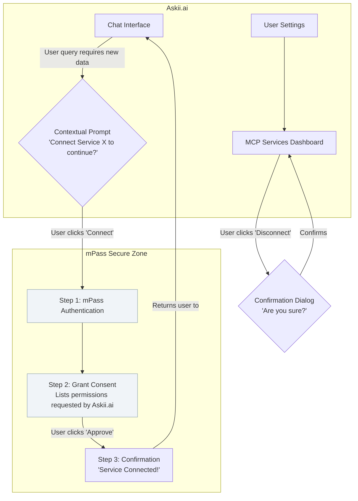
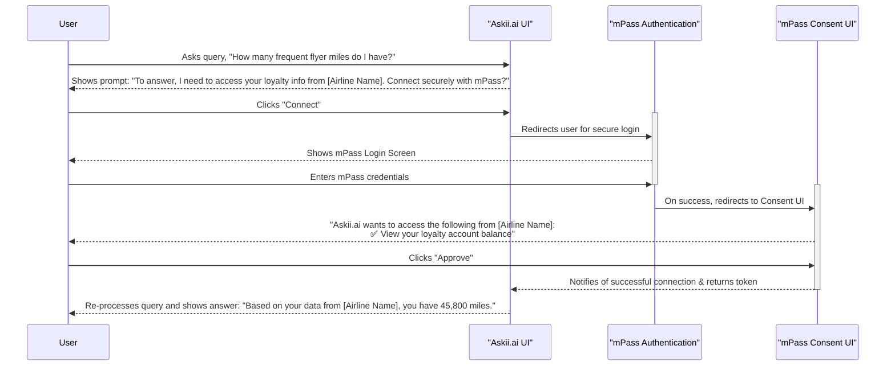
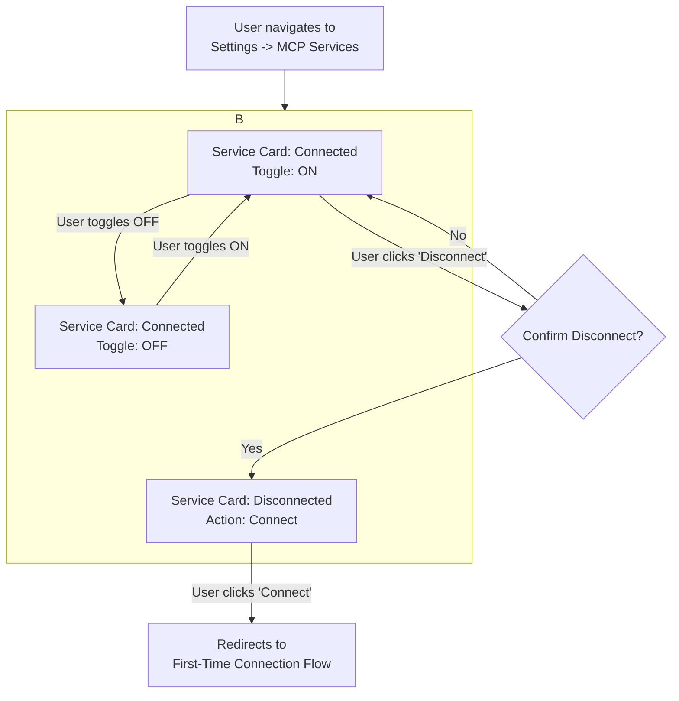

# mPass Personal Data Framework UI/UX Specification

| Date        | Version | Description | Author      |
|-------------|---------|-------------|-------------|
| 11 Aug 2025 | 1.0     |             | Diem Nguyen |

## 1. Introduction

This document defines the user experience goals, information architecture, user flows, and visual design specifications for the **mPass Personal Data Framework's** user interface. It serves as the foundation for visual design and frontend development, ensuring a cohesive and user-centered experience.

The primary goal is to transform Askii.ai from a generic assistant into a hyper-personalized companion by solving the "Amnesiac AI" problem, allowing it to securely access user data with their full consent. The user experience for connecting these data sources must be **secure, transparent, and simple**.

### 1.1. Target User Personas

Based on the PRD, our primary user is a tech-savvy individual who values efficiency and is an early adopter of AI tools, but is frustrated by their lack of context and is cautious about data privacy. They need a system they can trust implicitly.

### 1.2. Usability Goals

- **Trustworthiness**: Every screen, interaction, and word must be designed to build and reinforce user trust. The process must feel transparent and secure, leveraging the established trust of the mPass brand.

- **Clarity**: The user must always understand what is being asked, why it's being asked, and what the outcome of their choice will be.

- **Efficiency**: The consent process should be as frictionless as possible. The entire connection and consent flow should take **under 3 seconds**, excluding user interaction time (NFR3).

### 1.3. Design Principles

1. **Trust is the Default**: Design every component to be inherently reassuring. Use clear language, familiar patterns, and visual cues from the trusted mPass brand.

2. **Explicit Consent, Effortless Experience**: The user's choice to grant consent must be explicit and clear, but the journey to and from that choice should be seamless.

3. **The User is Always in Control**: The user must feel empowered to grant, view, and revoke access easily and instantly. The UI must constantly reinforce their agency (FR10).

## 2. Information Architecture

The information architecture is for an *embedded experience*. Its components are accessed contextually from within existing application structures.

### 2.1. Site Map / Screen Inventory

This diagram illustrates the key screens and the required flow, showing that **authentication happens before consent** is granted (FR4, FR5).

### 2.2. Navigation Structure

- **Primary Navigation**: The mPass framework does not introduce new primary navigation paradigms. Its user-facing components are accessed contextually from within existing application structures:

  1. **Consent Flow**: Initiated via in-line prompts directly within the Askii.ai chat interface.
  
  2. **Management Dashboard**: Located within the existing "Settings" or "Profile" section of the Askii.ai platform, under a label such as "MCP Services" or "Connected Services".

- **Secondary Navigation**: The mPass Consent UI itself will use a simple, linear step indicator (e.g., "Step 1 of 3") to clearly guide the user through the multi-step connection process.

- **Breadcrumb Strategy**: Not applicable for the modal-based consent flow. Standard breadcrumbs should be used for the management dashboard if it is nested within a settings hierarchy (e.g., Home > Settings > Connected Services).

## 3. User Flows

Based on the PRD, there are two critical user flows for the MVP.

### 3.1. Flow 1: MO Data MCP Server Connection (The "Happy Path")

- **User Goal**: To seamlessly and securely connect their Membership Organization (MO) data to Askii.ai.
- **Entry Points**: The user makes a query in Askii.ai that requires data from an unconnected MO (Story 2.5).
- **Success Criteria**: The user successfully authenticates and grants consent, allowing Askii.ai to use the new data to provide a personalized answer. The user feels secure and in control throughout the process.

#### Flow Diagram

This diagram shows the correct sequence using an airline as the example Membership Organization.

#### Edge Cases & Error Handling

- **User Denies Consent**: If the user clicks "Deny" on the Consent UI, the flow terminates gracefully. The user is returned to the Askii.ai chat interface with a message like, "No problem. I won't connect to [Airline Name]. Is there anything else I can help with?"

- **User Abandons Flow**: If the user closes the mPass authentication or consent window, the flow is cancelled. No connection is made, and no further action is taken until the user re-initiates.

- **Authentication Fails**: If the user fails to log in to mPass, the mPass UI should show a clear, standard error message.

- **Post-Consent Failure**: If the user approves consent but the backend fails to create the connection token, the user should see a clear error message in the mPass UI (e.g., "Something went wrong. We couldn't complete the connection. Please try again.") with an option to "Try Again" or "Cancel".

- **Network Interruption**: If the user's network connection is lost during the flow, the UI should attempt to handle it gracefully. If an action cannot be completed, a message like "Network connection lost. Please check your connection and try again." should be displayed.

### 3.2. Flow 2: Managing Connected Services

- **User Goal**: To easily view all connected services and revoke access when needed (Story 2.4).
- **Entry Points**: User navigates to "Settings" > "MCP Services" in Askii.ai.
- **Success Criteria**: The user can successfully find the dashboard, understand the status of each service, and disconnect or temporarily disable them with confidence. If they wish to connect a different account, they can disconnect the current one and initiate a new connection.

#### Flow Diagram

This diagram illustrates the different states and actions available to the user on the connection management dashboard.

#### Edge Cases & Error Handling

- **Dashboard Fails to Load**: If the list of connected services cannot be fetched from the server, the dashboard should display an error state with a message like "We couldn't load your connections right now. Please try again later." and a retry button.

- **Empty State**: If the user has never connected a service, the dashboard must display a clear "empty state" message, such as "You haven't connected any services yet. When you do, they will appear here."

- **Revocation Fails**: If the user clicks "Disconnect" but the backend fails to revoke the token, the UI must not show a success state. It should display an error message (e.g., a temporary toast notification) saying, "Could not disconnect [Service Name]. Please try again." The service should remain in its "Connected" state on the dashboard.

- **Toggle Fails**: If the user flips the activation toggle but the state change fails on the backend, the toggle should revert to its original position, accompanied by a brief error message explaining the failure.

## 4. Wireframes & Mockups

The source of truth for all high-fidelity mockups and prototypes will be a Figma project, created based on these specifications. The following conceptual layouts establish the core structure.

### 4.1. Key Screen Layouts

#### Screen 1: The Contextual Connection Prompt (within Askii.ai)

- **Purpose**: To prompt the user to connect their MO Data MCP server when Askii.ai needs their personal data (Story 2.5).

- **Key Elements**:
  - **Triggering Query**: The user's own prompt that required the new data.
  - **Clear Explanation**: A single sentence explaining *why* the connection would help answer the user's question.
  - **Data Preview**: A brief mention of the type of data that will be accessed.
  - **Primary Call-to-Action (CTA)**: A prominent "Connect with mPass" button.
  - **Secondary Action**: A subtle "No thanks" option, which allows the user to dismiss the prompt.

#### Screen 2: The mPass Consent UI

- **Purpose**: To provide a secure, clear, and trustworthy interface for the user to grant explicit consent *after* they have authenticated (Story 2.2).

- **Key Elements**:
  - **Clear Branding**: Prominently display the mPass logo and the partner MO's logo.
  - **Requesting Service**: Clearly show the icon and name of the service requesting access.
  - **Granular Permissions List**: A simple, non-technical, and clear list of the specific data types being requested. This must include examples such as:
    - ✅ Access your personal profile
    - ✅ View preferences and behavioral data
    - ✅ Read transaction history
  - **Primary CTA**: A prominent "Approve" or "Allow Access" button.
  - **Secondary Action**: A clear "Deny" button.

#### Screen 3: The Connected Services Dashboard

- **Purpose**: To give users a single place to view and manage their connected services, reinforcing user control (Story 2.4).

- **Key Elements**:
  - **Header**: "MCP Services".
  - **Service List**: A list of all previously connected services.
  - **Service Card** (for each service):
    - Service Icon & Name
    - Connection Date
    - Permissions Granted (viewable list)
    - Status Indicator (e.g., Active, Expired)
    - **Activation Toggle (On/Off Switch)**: A toggle to temporarily pause the integration
    - **Action Buttons**: "Disconnect" (with confirmation dialog) or "Connect"

## 5. Branding & Style Guide

The visual identity must be a harmonious blend of the trusted mPass brand and the existing dark, professional theme of Askii.ai.

### 5.1. Visual Identity

- **Brand Guidelines**: The UI will use mPass and partner MO logos to establish trust. However, the overall color scheme, typography, and component styling will be adapted to match the host application's dark theme.

### 5.2. Color Palette (Dark Theme Adaptation)

This palette should be derived from the existing Askii.ai interface to ensure a seamless look and feel.

| Color Type      | Hex Code (Representative) | Usage                                                          |
|-----------------|---------------------------|----------------------------------------------------------------|
| Background      | #121212                   | Main application background                                    |
| UI Surface      | #1E1E1E                   | Sidebars, Modals, Cards                                       |
| Primary Text    | #F8F9FA                   | Headings, body copy                                           |
| Secondary Text  | #ADB5BD                   | Subtitles, captions, disabled text                           |
| Interactive     | #FFFFFF                   | Primary CTAs (text or icon color), active states             |
| Borders         | #343A40                   | Subtle separators, component outlines                         |
| Success         | #28A745                   | Success messages, "Connected" status                          |
| Error           | #DC3545                   | Error messages, destructive action text/icons                |

### 5.3. Typography

- **Font Families**:
  - **Primary**: We will continue with a **clean, sans-serif system font** (like Inter, Roboto, or similar) to match the existing Askii.ai application.

- **Type Scale**: The existing type scale from Askii.ai should be adopted for all components to ensure a perfect match.

### 5.4. Iconography

- **Icon Library**: We will use a simple, single-color, outlined icon set (like Heroicons or Lucide) to match the style of the existing icons in the Askii.ai UI.

### 5.5. Spacing & Layout

- **Grid & Spacing**: We will adopt the existing spacing system (which appears to be an 8pt grid) from Askii.ai for all margins and padding to ensure rhythmic consistency.

- **Component Style**: All components, especially buttons and modals, will use rounded corners to match the aesthetic of the chat input and other UI elements.

## 6. Responsiveness Strategy

We will take a **mobile-first** approach.

### 6.1. Breakpoints

| Breakpoint | Min Width | Target Devices                                          |
|------------|-----------|--------------------------------------------------------|
| Mobile     | 320px     | Small to large smartphones                             |
| Tablet     | 768px     | iPads, Android tablets (portrait & landscape)         |
| Desktop    | 1024px    | Laptops, desktop monitors                              |

### 6.2. Adaptation Patterns

- **Layout Changes**:
  - **Consent Modal**: On **Mobile**, the modal will take up the full screen to maximize readability. On **Tablet and Desktop**, it will be a centered modal with a backdrop.
  - **Dashboard**: On **Mobile**, service cards will be a single-column vertical list. On **Tablet and Desktop**, we may introduce a two-column grid layout.

- **Interaction Changes**:
  - All interactions will be designed with touch as the primary input method. Hover states will be added for desktop users, but all functionality will be fully accessible without relying on hover. Touch targets will be at least 44x44 pixels.

- **Content Priority**:
  - On smaller screens, we will ensure that the most critical information (who is requesting access, what they want) and the primary actions ("Allow"/"Deny") are always visible without scrolling. Less critical explanatory text may be positioned lower in the visual hierarchy.

## 7. Animation & Micro-interactions

Motion design will be subtle, professional, and purposeful.

### 7.1. Motion Principles

- **Responsive & Quick**: Animations should be fast (under 300ms) and directly responsive to user input.
- **Informative, Not Decorative**: Motion will be used to provide feedback and guide focus.
- **Performance First**: All animations must be performant, primarily using CSS transforms.

### 7.2. Key Animations

- **Modal Entrance/Exit**: The consent modal will fade in and scale up slightly upon opening.
- **Button Press**: Buttons will subtly scale down when pressed.
- **Loading States**: When an action triggers a server request, the button that was clicked will display a subtle loading spinner inside it and become disabled.

## 8. Performance Considerations

Performance is a critical feature for building trust.

### 8.1. Performance Goals

- **Largest Contentful Paint (LCP)**: Under 2.5 seconds for the consent modal and dashboard.
- **Interaction to Next Paint (INP)**: The UI must respond to user input in under 200ms to feel instantaneous.
- **Animation FPS**: All animations must maintain a steady 60 frames per second (FPS).

### 8.2. Design Strategies

- **Optimized Assets**: All images and logos will be delivered in modern, compressed formats (like SVG or WebP).
- **Code Splitting**: The JavaScript and CSS for the mPass components will be bundled separately and loaded only when needed.
- **No Heavy Dependencies**: The component library will be built with minimal external dependencies.

## 9. Accessibility Requirements

- **Standard**: **WCAG 2.1 Level AA**. All components and user flows must meet this standard as a minimum requirement.
- **Key Requirements**: High color contrast ratios, visible keyboard focus indicators, screen reader support with proper ARIA labels, and logical tab order are mandatory.

## 10. Next Steps

1. **Stakeholder Review**: Review this specification with Product and Engineering.
2. **High-Fidelity Mockups**: Create detailed mockups and prototypes in Figma.
3. **Frontend Architecture**: Plan the technical architecture of the embeddable component library.