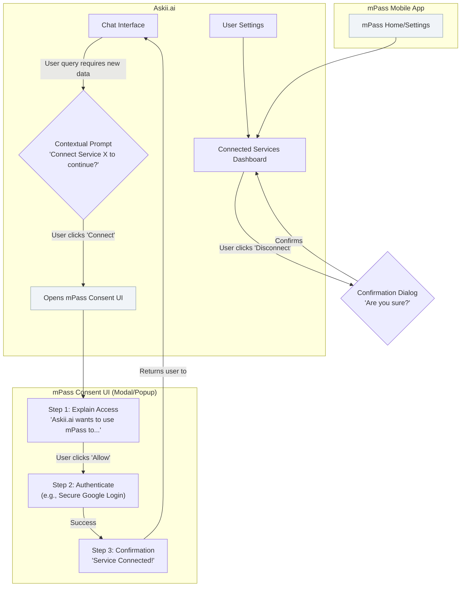
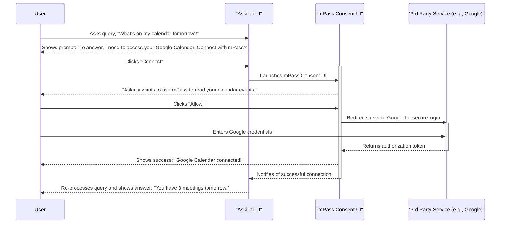
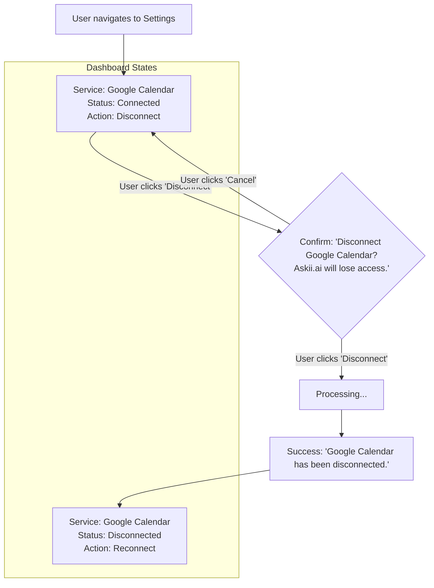

# mPass Personal Data Framework UI/UX Specification

## Introduction

This document defines the user experience goals, information architecture, user flows, and visual design specifications for the **mPass Personal Data Framework's** user interface. It serves as the foundation for visual design and frontend development, ensuring a cohesive and user-centered experience.

### Overall UX Goals & Principles

#### Target User Personas

Based on the PRD, our primary user is the **"Delegator" Professional**: A tech-savvy individual who values efficiency and is an early adopter of AI tools, but is frustrated by their lack of context and is cautious about data privacy. They need a system they can trust implicitly.

#### Usability Goals

*   **Trustworthiness:** Every screen, interaction, and word must be designed to build and reinforce user trust. The process must feel transparent and secure.
*   **Clarity:** The user must always understand what is being asked, why it's being asked, and what the outcome of their choice will be. There should be no ambiguity.
*   **Efficiency:** The consent process should be as frictionless as possible, allowing the user to grant permission and return to their primary task in Askii.ai with minimal disruption.

#### Design Principles

1.  **Trust is the Default:** Design every component to be inherently reassuring. Use clear language, familiar patterns, and visual cues from the trusted mPass brand.
2.  **Explicit Consent, Effortless Experience:** The user's choice to grant consent must be explicit and clear, but the journey to and from that choice should be seamless and integrated into their workflow.
3.  **The User is Always in Control:** The user must feel empowered to grant, view, and revoke access easily and instantly. The UI must constantly reinforce their agency.

### Change Log

| Date | Version | Description | Author |
| :--- | :--- | :--- | :--- |
|      | 0.1 | Initial Draft | Sally (UX) |

## Information Architecture (IA)

The information architecture for the mPass framework is not for a traditional website, but for an *embedded experience* that lives within two existing applications: **Askii.ai** and the **mPass mobile app**. The architecture is designed to be seamless and contextual.

### Site Map / Screen Inventory

This diagram illustrates the key screens and the flow between the different application contexts.

### Navigation Structure

*   **Primary Navigation:** The mPass framework does not introduce new primary navigation paradigms. Its user-facing components are accessed contextually from within existing application structures:
    1.  **Consent Flow:** Initiated via in-line prompts directly within the Askii.ai chat interface.
    2.  **Management Dashboard:** Located within the existing "Settings" or "Profile" section of both the Askii.ai platform and the mPass mobile app.

*   **Secondary Navigation:** The mPass Consent UI itself will use a simple, linear step indicator (e.g., "Step 1 of 3") to clearly guide the user through the multi-step connection process.

*   **Breadcrumb Strategy:** Not applicable for the modal-based consent flow. Standard breadcrumbs should be used for the management dashboard if it is nested within a settings hierarchy (e.g., `Home > Settings > Connected Services`).

## User Flows

Based on the PRD and our IA, there are two critical user flows for the MVP.

### Flow 1: First-Time Service Connection (The "Happy Path")

*   **User Goal:** To seamlessly and securely connect a third-party service (like Google Calendar) to Askii.ai for the first time.
*   **Entry Points:** The user makes a query in Askii.ai that requires data from an unconnected service.
*   **Success Criteria:** The user successfully connects the service and Askii.ai is able to use the new data to provide an enhanced answer, with the user feeling secure and in control throughout the process.

#### Flow Diagram

#### Edge Cases & Error Handling:

*   **User Denies Consent:** If the user clicks "Deny" in the mPass UI, the flow terminates, and Askii.ai shows a message like, "No problem. I won't connect to your calendar. Is there something else I can help with?"
*   **User Abandons Flow:** If the user closes the consent modal, the flow is cancelled. No connection is made.
*   **Third-Party Login Fails:** If the user fails to log in to the third-party service, the mPass UI should show a clear error message with an option to "Try Again" or "Cancel".

---

### Flow 2: Managing Connected Services (Revised)

*   **User Goal:** To easily view all connected services, manage their connection status, and revoke access when needed.
*   **Entry Points:** User navigates to "Settings" > "Connected Services" in either Askii.ai or the mPass mobile app.
*   **Success Criteria:** The user can successfully find the dashboard, understand the status of each service, and disconnect or reconnect them with confidence.

#### Flow Diagram

#### Flow Description & States

1.  The user navigates to the "Connected Services" dashboard.
2.  The dashboard displays a list of all services the user has previously interacted with.
3.  Each service card has a clear status indicator:
    *   **Connected:** The service is active. The primary action is **"Disconnect"**.
    *   **Disconnected:** The service is inactive. The primary action is **"Reconnect"**.
4.  When a user clicks "Disconnect" on a connected service, a confirmation dialog appears.
5.  Upon confirmation, the system revokes the access token.
6.  The service card in the dashboard **updates its state** from "Connected" to "Disconnected", and the action button changes from "Disconnect" to "Reconnect". The service entry **does not disappear**.
7.  Clicking "Reconnect" would initiate the same "First-Time Service Connection" flow (Flow 1) to establish a new connection.

#### Edge Cases & Error Handling:

*   **Revocation Fails:** If the system fails to revoke the token from the third party, the UI should show a clear error message, and the service should remain in the "Connected" state.
*   **No Services Ever Connected:** The dashboard will show a clear "empty state" with a message like, "You haven't connected any services yet."

## Wireframes & Mockups

For a project this sensitive, detailed visual designs are best created in a dedicated tool like Figma, where we can perfect every pixel and interaction. However, I can create low-fidelity conceptual layouts here to establish the core structure and content hierarchy for the most critical screens.

**Primary Design Files:** The source of truth for all high-fidelity mockups and prototypes will be a Figma project, which will be created based on these specifications. [Link to be added]

### Key Screen Layouts (Revised)

#### Screen 1: The Contextual Consent Prompt (within Askii.ai)

*   **Purpose:** To inform the user that Askii.ai needs additional permissions to fulfill their request and to provide a clear, low-friction entry point to the mPass consent flow.
*   **Key Elements:**
    *   **Triggering Query:** The user's own prompt that required the new data.
    *   **Clear Explanation:** A single sentence explaining what is needed. e.g., "To answer that, I need to connect to your Google Calendar."
    *   **Trust-Building Statement:** A brief mention of the secure method. e.g., "I can do this securely using your mPass."
    *   **Primary Call-to-Action (CTA):** A prominent "Connect" or "Continue with mPass" button.
    *   **Secondary Action:** A subtle "Cancel" or "No thanks" option.
*   **Interaction Notes:** This should appear smoothly and contextually within the chat flow, not as an aggressive, disruptive popup. It should feel like part of the conversation.

#### Screen 2: The mPass Consent UI (Revised)

*   **Purpose:** To provide a secure, clear, and trustworthy interface for the user to grant explicit consent. This screen is the heart of the user's trust experience.
*   **Key Elements:**
    *   **Clear Branding:** Prominently display the mPass logo and the partner MO's logo.
    *   **Requesting Service:** Clearly show the icon and name of the service requesting access (e.g., "Google Calendar").
    *   **Permissions List:** A simple, non-technical list of what will be accessed. e.g., "✅ View your calendar events", "✅ See event attendees". Use checkmarks to create a positive, permissive feel.
    *   **Primary CTA:** A prominent "Allow Access" button.
    *   **Secondary Action:** A clear "Deny" button.
*   **Interaction Notes:** The UI should appear in a modal window or a secure popup that temporarily takes focus, signaling a secure transaction is taking place. The transition should be smooth.

#### Screen 3: The Connected Services Dashboard (Revised)

*   **Purpose:** To give users a single, clear place to view, manage, and temporarily enable or disable their connected services, reinforcing the principle of user control.
*   **Key Elements:**
    *   **Header:** "Connected Services".
    *   **Service List:** A list of all services the user has previously connected.
    *   **Service Card (for each service):**
        *   Service Icon & Name (e.g., Google Calendar).
        *   **Activation Toggle (On/Off Switch):** A clear toggle to temporarily enable or disable Askii.ai's ability to use the service in conversations. The default state is "On".
        *   Status Indicator (e.g., "Connected" or "Disconnected").
        *   Primary Action Button (e.g., "Disconnect" or "Reconnect").
*   **Interaction Notes:**
    *   The **Toggle** provides a quick, low-friction way to pause a service's integration without completely disconnecting it. This is useful if a user wants to temporarily exclude a data source from their queries. The state of the toggle is saved instantly.
    *   The **"Disconnect"** button remains the "hard-stop" action that revokes the token and requires the full reconnection flow.

## Component Library / Design System (Revised)

**Design System Approach:** We will create a new, lightweight component library for the mPass UI. **Crucially, these components must be theme-aware, adapting to the dark, minimalist aesthetic of the host Askii.ai application** while maintaining a consistent and trusted mPass brand identity.

## Branding & Style Guide (Revised)

The visual identity must be a harmonious blend of the trusted mPass brand and the existing dark, professional theme of Askii.ai.

**Visual Identity:**
*   **Brand Guidelines:** The UI will use mPass and partner MO logos to establish trust. However, the overall color scheme, typography, and component styling will be adapted to match the host application's dark theme.

**Color Palette (Dark Theme Adaptation):**
*   This palette is derived from the provided screenshot of the Askii.ai interface.

| Color Type | Hex Code (Representative) | Usage |
| :--- | :--- | :--- |
| Background | `#121212` | Main application background |
| UI Surface | `#1E1E1E` | Sidebars, Modals, Cards |
| Primary Text| `#F8F9FA` | Headings, body copy |
| Secondary Text| `#ADB5BD` | Subtitles, captions, disabled text |
| Interactive | `#FFFFFF` | Primary CTAs (text or icon color), active states |
| Borders | `#343A40` | Subtle separators, component outlines |
| Success | `#28A745` | Success messages, "Connected" status |
| Error | `#DC3545` | Error messages, destructive action text/icons |

**Typography:**
*   **Font Families:**
    *   **Primary:** We will continue with a **clean, sans-serif system font** (like the one used in Askii.ai, which appears to be Inter, Roboto, or similar). This ensures consistency and a native feel.
*   **Type Scale:** The existing type scale from Askii.ai should be adopted for all components to ensure a perfect match.

**Iconography:**
*   **Icon Library:** We will use a simple, single-color, outlined icon set (like Heroicons) to match the style of the existing icons in the Askii.ai sidebar.

**Spacing & Layout:**
*   **Grid & Spacing:** We will adopt the existing spacing system (which appears to be an 8pt grid) from Askii.ai for all margins and padding to ensure rhythmic consistency.
*   **Component Style:** All components, especially buttons and modals, will use rounded corners to match the aesthetic of the chat input and other UI elements.

## Accessibility Requirements

**Compliance Target:**
*   **Standard:** **WCAG 2.1 Level AA**. All components and user flows must meet this standard as a minimum requirement.

**Key Requirements:**

*   **Visual:**
    *   **Color contrast ratios:** All text must have a contrast ratio of at least 4.5:1 against its background.
    *   **Focus indicators:** All interactive elements (buttons, links, toggles, form fields) must have a clearly visible focus state when navigated to via a keyboard.
    *   **Text sizing:** Users must be able to zoom the interface to 200% without loss of content or functionality.

*   **Interaction:**
    *   **Keyboard navigation:** All functionality must be operable through a keyboard alone. The tab order must be logical and intuitive.
    *   **Screen reader support:** All components must be correctly identified by screen readers (e.g., JAWS, VoiceOver). Buttons, toggles, and inputs must have clear, descriptive ARIA labels.
    *   **Touch targets:** On mobile devices, all touch targets must be at least 44x44 pixels to be easily tappable.

*   **Content:**
    *   **Alternative text:** All meaningful images and icons must have descriptive `alt` text. Decorative images should have empty `alt` attributes.
    *   **Heading structure:** The UI must use a logical heading structure (H1, H2, H3) to define the page hierarchy.
    *   **Form labels:** All form inputs must have clearly associated, programmatically-linked `<label>` elements.

**Testing Strategy:**
*   Accessibility will be tested through a combination of automated tools (e.g., Axe, Lighthouse), manual keyboard and screen reader testing, and testing with users who have disabilities. This testing will be a required step before any feature is considered "done".

## Responsiveness Strategy

Our user-facing components will be embedded in both a web platform (Askii.ai) and a native mobile app (mPass). Therefore, a robust and fluid responsive strategy is essential. We will take a **mobile-first** approach.

**Breakpoints:**
*   Our design will be fluid and adapt to the container it's in, but we will use these standard breakpoints for testing and targeted style adjustments.

| Breakpoint | Min Width | Target Devices |
| :--- | :--- | :--- |
| Mobile | 320px | Small to large smartphones |
| Tablet | 768px | iPads, Android tablets (portrait & landscape) |
| Desktop | 1024px | Laptops, desktop monitors |
| Wide | 1440px | Large desktop monitors |

**Adaptation Patterns:**

*   **Layout Changes:**
    *   **Consent Modal:** On **Mobile**, the modal will likely take up the full screen to maximize readability and focus. On **Tablet and Desktop**, it will be a centered modal with a backdrop, clearly separate from the underlying page.
    *   **Dashboard:** On **Mobile**, the service cards will be a simple, single-column vertical list. On **Tablet and Desktop**, we may introduce a two-column grid layout if the number of services grows, to make better use of the horizontal space.

*   **Navigation Changes:**
    *   Navigation is minimal, but any secondary navigation within the dashboard (e.g., tabs for different settings) would be placed at the top on desktop and potentially at the bottom (as a tab bar) on mobile for easier reachability.

*   **Content Priority:**
    *   On smaller screens, we will ensure that the most critical information (who is requesting access, what they want) and the primary actions ("Allow"/"Deny") are always visible without scrolling. Less critical explanatory text may be positioned lower in the visual hierarchy.

*   **Interaction Changes:**
    *   All interactions will be designed with touch as the primary input method. Hover states will be added for desktop users to provide additional feedback, but all functionality will be fully accessible without relying on hover. Touch targets will be large on all screen sizes.

## Animation & Micro-interactions

Thoughtful motion design can make the interface feel more responsive, guide the user's attention, and build confidence in the system. Our animations will be subtle, professional, and purposeful.

**Motion Principles:**

*   **Responsive & Quick:** Animations should be fast (typically under 300ms) and directly responsive to user input, making the UI feel snappy and alive.
*   **Informative, Not Decorative:** Motion will be used to provide feedback, guide focus, and explain transitions. We will avoid purely decorative animations that could be distracting.
*   **Performance First:** All animations must be performant, primarily using CSS transforms (`translate`, `scale`, `opacity`) to avoid causing stutter or jank.

**Key Animations:**

*   **Modal Entrance/Exit:** (Duration: 250ms, Easing: ease-out)
    *   The consent modal will fade in and scale up slightly upon opening, and fade out and scale down upon closing. This is a standard, non-jarring way to handle modal transitions.
*   **Button Press:** (Duration: 100ms, Easing: ease-in-out)
    *   Buttons will subtly scale down when pressed, providing clear, immediate physical feedback for the user's action.
*   **Toggle Switch:** (Duration: 200ms, Easing: ease-in-out)
    *   The circle on the activation toggle will slide smoothly from one side to the other, with a gentle color transition.
*   **Loading States:**
    *   When an action triggers a server request (e.g., clicking "Allow" or "Disconnect"), the button that was clicked will display a subtle loading spinner inside it and become disabled. This provides clear feedback that the system is working.
*   **Dashboard Item Update:** (Duration: 300ms, Easing: ease-out)
    *   When a service is disconnected, its card will cross-fade from the "Connected" state to the "Disconnected" state, providing a smooth visual transition instead of an abrupt change.

## Performance Considerations

From a user experience perspective, performance is a critical feature. A slow or unresponsive interface can erode trust just as much as a security flaw.

**Performance Goals:**

*   **Page Load:** The initial load for the consent modal and the management dashboard must be fast. We will target a **Largest Contentful Paint (LCP)** of under 2.5 seconds.
*   **Interaction Response:** The UI must respond to user input (clicks, toggles) in under 100ms to feel instantaneous.
*   **Animation FPS:** All animations must maintain a steady 60 frames per second (FPS) to appear perfectly smooth.

**Design Strategies:**

*   **Optimized Assets:** All images, logos, and icons will be delivered in modern, compressed formats (like SVG for icons, WebP for images) to minimize their file size.
*   **Lazy Loading:** For the management dashboard, if a user has a very long list of connected services, we will lazy-load the service cards that are off-screen to improve initial render time.
*   **Code Splitting:** The JavaScript and CSS for the mPass components will be bundled separately from the main Askii.ai and mPass applications. This ensures the host apps don't have to load our code until it's actually needed (i.e., when the consent flow is triggered).
*   **No Heavy Dependencies:** The component library will be built with minimal to no external dependencies to keep the bundle size small and avoid pulling in unnecessary code.

## Next Steps

This UI/UX Specification provides a comprehensive foundation for the visual design and front-end development of the mPass Personal Data Framework's user interface.

**Immediate Actions:**

1.  **Stakeholder Review:** This document should be reviewed by the Product Manager, lead developers, and key stakeholders from the mPass and partner MO teams to ensure alignment.
2.  **High-Fidelity Mockups:** A visual designer should now use this specification to create high-fidelity mockups and prototypes in Figma, perfecting the visual details and interaction designs.
3.  **Frontend Architecture:** A front-end architect should use this specification to plan the technical architecture of the embeddable component library.

**Design Handoff Checklist:**

*   [x] All user flows documented
*   [x] Component inventory complete
*   [x] Accessibility requirements defined
*   [x] Responsive strategy clear
*   [x] Brand guidelines incorporated
*   [x] Performance goals established
